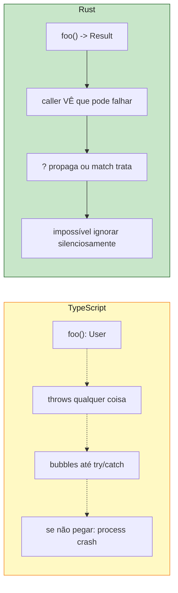
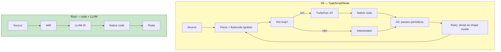

<a id="capitulo-53"></a>
# Capítulo 53: Rust vs TypeScript — Tipos no Compilador vs no Runtime

> *"TypeScript is JavaScript that scales. Rust is C that doesn't bite."*
> — anônimo, comentário em Hacker News, 2023

> *"O compilador é o seu primeiro code review. Em TypeScript ele é gentil. Em Rust ele é honesto."*
> — adaptado de Niko Matsakis

## 53.1 O Mal-Entendido Fundamental

Se você programa TypeScript há tempo suficiente, em algum momento alguém te disse: "TypeScript é tipo o Rust do mundo JS". A frase é simpática. É também **enganosa o bastante para te custar uma noite de sono** quando você começar Rust achando que vai ser parecido.

Os dois sistemas de tipos compartilham vocabulário — `enum`, `interface`, `generic`, `trait`-ish — mas resolvem problemas opostos.

| Pergunta | TypeScript | Rust |
|---|---|---|
| Quando os tipos existem? | **Compile time apenas** (erasure) | **Compile time E runtime** (representação real) |
| Os tipos são *sound*? | Não — `any`, `as`, runtime mismatch | Sim, soundness é meta de design |
| Erros são parte do tipo? | Não — qualquer função pode `throw` | Sim — `Result<T, E>` no return |
| Async tem custo? | GC + event loop single-thread | Zero — `Future` é uma struct |
| Memória? | V8 garbage collector | Ownership, sem GC |
| Performance? | JIT V8 (rápido pra GC lang) | Nativo, sempre |

TypeScript é o melhor *sistema de tipos opcional sobre uma linguagem dinâmica* já feito. Rust é uma linguagem **construída ao redor do sistema de tipos**. Saber a diferença muda como você lê código nos dois.

## 53.2 Erasure vs Representação Real

O exemplo canônico — você roda os dois e compara o que sobra.

```ts
// TypeScript
interface User {
  id: string;
  name: string;
  age: number;
}

function greet(u: User): string {
  return `Olá, ${u.name}`;
}

// Em runtime, o JS gerado é:
function greet(u) {
  return `Olá, ${u.name}`;
}
// O tipo User SUMIU. Não existe.
```

```rust
// Rust
struct User {
    id: String,
    name: String,
    age: u32,
}

fn greet(u: &User) -> String {
    format!("Olá, {}", u.name)
}

// Em runtime, User é uma struct com layout fixo:
// [ptr+len+cap String][ptr+len+cap String][u32]
// O compilador sabe o tamanho exato. Cada campo está num offset conhecido.
```

A consequência prática é brutal:

```ts
// TypeScript — mentira possível em runtime
function parse(json: string): User {
  return JSON.parse(json) as User;  // <-- "as" é uma promessa vazia
}

const u = parse('{"id":"1"}'); // age e name não existem
console.log(u.age.toFixed(2)); // 💥 TypeError: cannot read property 'toFixed' of undefined
// O compilador disse que `u: User`. O runtime discordou.
```

```rust
// Rust — não compila se você tentar mentir
use serde::Deserialize;

#[derive(Deserialize)]
struct User { id: String, name: String, age: u32 }

fn parse(json: &str) -> Result<User, serde_json::Error> {
    serde_json::from_str(json)
    //          ^^^^^^^^^^^^^^ valida em runtime contra a struct real
}

let u = parse(r#"{"id":"1"}"#)?;  // Err: missing field `name`
// Você não pode pegar um User inválido. Ou tem todos os campos, ou tem um Err.
```

TypeScript te dá um *contrato* que você confia. Rust te dá uma *prova* que o compilador checa.

## 53.3 Soundness — A Palavra que TS Não Promete

Um sistema de tipos é **sound** quando: *se o programa compila, ele não pode ter erros de tipo em runtime*.

TypeScript foi explicitamente desenhado *não-sound*. A documentação oficial admite. O compilador permite:

```ts
// 1. Type assertion sem checagem
const x = "hello" as unknown as number;
x.toFixed(2); // 💥 runtime crash

// 2. any — buraco negro de tipos
function unsafe(x: any): string {
  return x.foo.bar.baz; // ok pro TS, bomba em runtime
}

// 3. Mutação de array readonly via aliasing
const xs: readonly number[] = [1, 2, 3];
const ys = xs as number[];
ys.push(4); // muta xs também — TS não detecta

// 4. Index signatures mentem
const obj: { [k: string]: number } = {};
const v = obj.qualquercoisa; // tipo: number, valor: undefined
v.toFixed(2); // 💥
```

Rust tem **três** escapes (`unsafe`, `transmute`, `unwrap`) e cada um é visualmente gritante:

```rust
// 1. unsafe é uma palavra-chave que aparece no diff
let x: u32 = unsafe { std::mem::transmute(3.14_f32) };
//                    ^^^^^^^^^^^^^^^^^^^ você está dizendo "eu sei o que faço"

// 2. unwrap entrega o pânico no nome
let x: u32 = some_result.unwrap();  // se for Err, panic
let y: u32 = some_result?;          // propaga Err — preferido

// 3. as é só pra conversão numérica e tem regras estritas
let x: u32 = 3.14_f64 as u32;  // 3 — sem mentira de tipo, só truncamento
```

Em TypeScript, `as` é o jeito de dizer "confia em mim". Em Rust, `as` é só conversão numérica explícita. **A palavra é a mesma. O significado é oposto.**

## 53.4 Exception Handling — A Diferença Existencial

Esse é o ponto que mais machuca o desenvolvedor TypeScript chegando em Rust. Em TypeScript, **qualquer função pode lançar uma exceção**, e o tipo de retorno **não diz isso**.

```ts
// TypeScript — o tipo mente
function parseAge(s: string): number {
  const n = parseInt(s, 10);
  if (isNaN(n)) throw new Error("invalid age");
  return n;
}

// Quem chama vê: (s: string) => number
// O que ela faz: (s: string) => number | throws Error
//                                          ^^^^^^^^^^^ invisível pro tipo

// Em qualquer ponto, qualquer função, pode lançar:
const x = parseAge(input);   // pode jogar
const y = JSON.parse(raw);   // pode jogar
const z = arr[0].name;       // pode jogar (TypeError)

// Resultado: try/catch ou crash. Sem garantia.
```

Java pelo menos tem `throws` na assinatura (checked exceptions). TypeScript herdou de JavaScript a tradição de exceções *invisíveis no tipo*. O resultado é que você **nunca sabe se um await pode jogar** — e quase sempre pode.

```rust
// Rust — o tipo é honesto
fn parse_age(s: &str) -> Result<u32, ParseIntError> {
    s.parse::<u32>()
}

// Quem chama vê: fn(&str) -> Result<u32, ParseIntError>
// O que ela faz: exatamente isso. Nada mais.

// O `?` propaga erros como exceptions, mas elas são tipadas:
fn process(input: &str) -> Result<u32, MyError> {
    let age = parse_age(input)?;        // Err vira return
    let doubled = age.checked_mul(2)    // Option (overflow possível)
        .ok_or(MyError::Overflow)?;
    Ok(doubled)
}
```

A diferença na prática:



Quando você escreve um endpoint em TypeScript, você envolve tudo em `try/catch` defensivo porque qualquer linha pode jogar. Em Rust, você **vê no tipo de retorno** se uma função pode falhar, e o compilador te força a tratar o caso.

Isso é o que faz código Rust de produção ter tão pouca *unhandled error in async context*. O tipo já te avisou.

## 53.5 Async — Promise Eager vs Future Lazy

Async em TS e em Rust *parece* igual. Não é.

```ts
// TypeScript — Promise é EAGER
async function fetchUser(id: string): Promise<User> {
  console.log("vai começar");
  const r = await fetch(`/users/${id}`);
  return r.json();
}

const p = fetchUser("1");   // <-- a request JÁ disparou
//                              o console.log JÁ rodou
//                              await ou não, ela está acontecendo
```

```rust
// Rust — Future é LAZY
async fn fetch_user(id: &str) -> Result<User, Error> {
    println!("vai começar");
    let r = reqwest::get(format!("/users/{id}")).await?;
    r.json::<User>().await
}

let f = fetch_user("1");    // <-- nada aconteceu
//                              println não rodou
//                              nenhuma request foi feita
//                              `f` é uma struct descrevendo o trabalho

let user = f.await?;        // <-- agora sim começa a rodar
```

Por que importa? Porque em Rust você compõe **planos de trabalho** antes de executar:

```rust
// Composição sem efeito — só descreve o que vai acontecer
let plan = futures::future::join_all(
    ids.iter().map(|id| fetch_user(id))
);

// Decisão de execução é separada de descrição
tokio::select! {
    result = plan => { /* tudo terminou */ }
    _ = tokio::time::sleep(Duration::from_secs(5)) => {
        // timeout — todas as tasks são canceladas automaticamente
        // porque elas nem tinham começado a rodar de verdade até o select
    }
}
```

Em TS, cancelamento de Promise é **um problema não resolvido** desde 2015. Você precisa de `AbortController` enfiado em todas as APIs. Em Rust, drop de uma `Future` cancela ela — porque a `Future` é **uma struct que você possui**, não um job rodando em background.

Adicione a isso:
- **TS**: single-thread (event loop), GC, callback queue, microtasks vs macrotasks
- **Rust**: multi-thread real (Tokio work-stealing scheduler), zero GC, zero hidden runtime

E você entende por que Discord trocou um serviço Go por Rust e cortou latência tail em 90% (caso real, post de 2020). O tail latency morre principalmente por GC pauses. Rust não tem.

## 53.6 Closures — "Você Decide" vs Três Traits

Closures parecem iguais. Não são.

```ts
// TypeScript — uma closure é uma função
const multiplier = 3;
const f = (x: number) => x * multiplier;
//        ^ captura `multiplier` por referência (sempre)

// Quantas vezes pode chamar? Quantas quiser.
// Pode mover entre threads? Não tem threads de verdade.
// Pode mutar capturado? Sim, sem tipo dizer nada:
let counter = 0;
const inc = () => counter++;
inc(); inc(); // counter = 2 — mutação invisível no tipo
```

Rust força você a expressar como a closure usa o ambiente, via três traits:

```rust
// Rust — três tipos de closure, expressos no sistema de tipos

// 1. Fn — captura por &T. Pode chamar N vezes. Multi-thread se T: Sync.
let multiplier = 3;
let f: impl Fn(i32) -> i32 = |x| x * multiplier;
//     ^^^^^^^^^^^^^^^^^^^ não muta nada externo

// 2. FnMut — captura por &mut T. Pode chamar N vezes. Não pode ser shared.
let mut counter = 0;
let mut inc: impl FnMut() = || counter += 1;
//           ^^^^^^^^^^^^^ muta — o tipo grita isso
inc(); inc();

// 3. FnOnce — consome o capturado. Pode chamar UMA vez.
let s = String::from("hello");
let consume: impl FnOnce() -> String = move || s;
//           ^^^^^^^^^^^^^^^^^^^^^^^ só uma chamada possível
let owned = consume();
// consume(); // ❌ s já foi movido
```

Por que três? Porque a forma como uma função recebe a closure muda quanto controle ela tem:

```rust
// Iterator::map aceita FnMut — pode mutar entre items
let mut total = 0;
let xs: Vec<i32> = (1..=5).map(|x| { total += x; x * 2 }).collect();
//                              ^^ mutação de fora — FnMut

// thread::spawn exige Fn + Send + 'static — multi-thread seguro
std::thread::spawn(move || println!("oi de outra thread"));

// Drop handler é FnOnce — só roda uma vez
let cleanup = || drop(file);
```

Em TypeScript, todas essas distinções existem **só na sua cabeça**. Você lê a closure e adivinha. Em Rust, o tipo te diz.

## 53.7 Generics — Erasure vs Monomorphization

Os dois usam `<T>`. O que o compilador faz com isso é radicalmente diferente.

```ts
// TypeScript — type erasure
function first<T>(xs: T[]): T | undefined {
  return xs[0];
}

// Em runtime, o JS gerado é:
function first(xs) { return xs[0]; }
// O T sumiu. Uma única função roda pra todos os tipos.
```

```rust
// Rust — monomorphization
fn first<T: Copy>(xs: &[T]) -> Option<T> {
    xs.first().copied()
}

let a = first::<i32>(&[1, 2, 3]);
let b = first::<f64>(&[1.0, 2.0]);

// Em compile time, o compilador gera DUAS funções:
// fn first_i32(xs: &[i32]) -> Option<i32> { ... }
// fn first_f64(xs: &[f64]) -> Option<f64> { ... }
// Cada uma especializada, inlineável, zero overhead.
```

Trade-offs reais:

| | TypeScript erasure | Rust monomorphization |
|---|---|---|
| Tamanho de binário | Pequeno (1 função) | Maior (N funções) |
| Performance | Sem inlining cross-type | Inlining + otimização total |
| Reflection | Impossível (tipos sumiram) | Impossível (mas por design) |
| Compile time | Rápido | Mais lento (Rust é famoso por isso) |
| Generic em interfaces de runtime | Funciona | Precisa `dyn Trait` (boxing) |

Quando você escreve `Array.prototype.map` em TS, é **uma função** rodando em runtime, fazendo `typeof` ou nada. Quando você escreve `Vec::map` em Rust, o compilador gera uma versão otimizada **para cada tipo concreto** — é por isso que `iter().map().filter().sum()` em Rust gera o mesmo assembly de um for-loop manual em C.

## 53.8 Discriminated Unions — Verboso vs Fundamental

Esse é o ponto onde TS chega *próximo* mas não chega lá.

```ts
// TypeScript — discriminated union via literal types
type Result<T, E> =
  | { kind: "ok"; value: T }
  | { kind: "err"; error: E };

function divide(a: number, b: number): Result<number, string> {
  if (b === 0) return { kind: "err", error: "div by zero" };
  return { kind: "ok", value: a / b };
}

const r = divide(10, 2);
if (r.kind === "ok") {
  console.log(r.value);   // narrowing funciona
} else {
  console.log(r.error);
}

// Mas: nada impede você de criar { kind: "ok" } sem `value`:
const fake: Result<number, string> = { kind: "ok" } as any;
// E o exhaustive check depende de você lembrar de usar `never`:
function handle(r: Result<number, string>): string {
  switch (r.kind) {
    case "ok": return String(r.value);
    case "err": return r.error;
    // Se faltar um case, TS só avisa se você usar default: never
  }
}
```

```rust
// Rust — enum é fundamental, não emulado
enum Result<T, E> {
    Ok(T),
    Err(E),
}

fn divide(a: f64, b: f64) -> Result<f64, &'static str> {
    if b == 0.0 { return Err("div by zero"); }
    Ok(a / b)
}

let r = divide(10.0, 2.0);
match r {
    Ok(v) => println!("{v}"),
    Err(e) => println!("{e}"),
    // Sem default. Se faltar variant, NÃO COMPILA.
}

// Você não pode construir um Ok sem o valor:
// let fake = Result::<f64, &str>::Ok;  // ❌ erro: faltam args
// let fake = Result::Ok(42);            // ✅ obrigatório passar valor
```

E enums em Rust podem ter comportamento (é um *tipo de primeira classe*):

```rust
impl<T, E> Result<T, E> {
    fn map<U>(self, f: impl FnOnce(T) -> U) -> Result<U, E> {
        match self {
            Ok(t) => Ok(f(t)),
            Err(e) => Err(e),
        }
    }
}

let doubled: Result<f64, &str> = divide(10.0, 2.0).map(|x| x * 2.0);
```

Em TS você simula. Em Rust é nativo. Bibliotecas inteiras (serde, tokio, axum) são construídas sobre o pressuposto de que enums são baratos, exhaustivos, e ricos.

## 53.9 Performance — V8 vs Nativo

Vamos ser honestos: V8 é assustadoramente bom. O JIT do V8, quando aquece, gera código surpreendente. Mas paga três pedágios fixos:



**Custos reais de TypeScript/Node:**
1. Cold start: parse + ignition antes de qualquer coisa rodar.
2. GC: a cada N MB alocados, pausa de 10-100ms (tail latency assassina).
3. Shape deopt: se você muda o "formato" de um objeto, V8 invalida o JIT.
4. Boxing implícito: todo número é float64; objetos são heap-allocated.

**Custos reais de Rust:**
1. Compile time longo (5-30s pra mudanças, minutos pra release).
2. Tamanho de binário maior (monomorphization).
3. Não tem reflection — você precisa decidir tudo em compile time.

Casos documentados de migração:

| Empresa | De | Para | Resultado |
|---|---|---|---|
| **Discord** (2020) | Go | Rust | Tail latency p99 de ~200ms para ~5ms (sem GC) |
| **Cloudflare** (2022) | NGINX (C) | Pingora (Rust) | 70% menos CPU, 67% menos memória, trilhões de req/dia |
| **Figma** (2023) | TS frontend perf | Rust + WASM (multiplayer) | Ops de geometria 3-5x mais rápido |
| **AWS Firecracker** | Go (concorrente) | Rust | <125ms boot pra microVM |

Esses não são benchmarks sintéticos. São migrações em produção feitas por times que já dominavam a stack original.

## 53.10 Onde TS Ganha (e está tudo bem)

Você não está lendo este capítulo pra decidir abandonar TypeScript. Não abandone. TS ganha em:

- **Velocidade de iteração**: HMR de Vite/Next em <100ms. Rust em segundos.
- **Ecossistema web**: React, Next, Astro, Solid, Svelte — não tem equivalente em Rust ainda.
- **Type inference top-down**: TS infere tipos de literal de objeto melhor que Rust em muitos casos.
- **DX de UI**: você não vai escrever JSX em Rust com a mesma fluidez (Leptos/Dioxus existem, mas não são React).
- **Onboarding**: dev júnior aprende TS em semanas. Rust em meses.

A regra prática: **TS pra glue code, UI, serviços de negócio com latência tolerante a GC. Rust pra hot paths, sistemas, perf-crítico, e código que precisa rodar fora do Node.**

## 53.11 A Conclusão Honesta

TypeScript é o melhor que se pode fazer com **tipos como camada opcional sobre uma linguagem dinâmica**. O sistema é expressivo, criativo, e em muitos aspectos vai *além* de Rust em manipulação de tipos (template literal types, conditional types — Rust não tem nada parecido).

Mas TypeScript paga três pedágios eternos:
1. Tipos somem em runtime (erasure).
2. Tipos não são sound (você pode mentir).
3. Erros não estão nos tipos (qualquer função pode jogar).

Rust é o oposto: tipos são *a estrutura* da linguagem. Eles persistem em runtime como layout de memória. São sound (modulo `unsafe` explícito). Erros estão no tipo de retorno. Async é uma struct que você possui. Closures se classificam em três traits. Generics geram código especializado.

**TypeScript te ensinou a pensar em tipos.** Bom — você já tem 70% do que precisa pra Rust. Os 30% restantes são o que faz Rust ser Rust: ownership, lifetimes, e a recusa do compilador em aceitar promessas vagas.

> *"TypeScript te dá a ilusão de segurança. Rust te dá a segurança e te tira a ilusão."*

[Próximo: Capítulo 54 — Rust vs Go: Concorrência, GC e Filosofia →](ch54-rust-vs-go.md)
