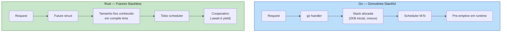
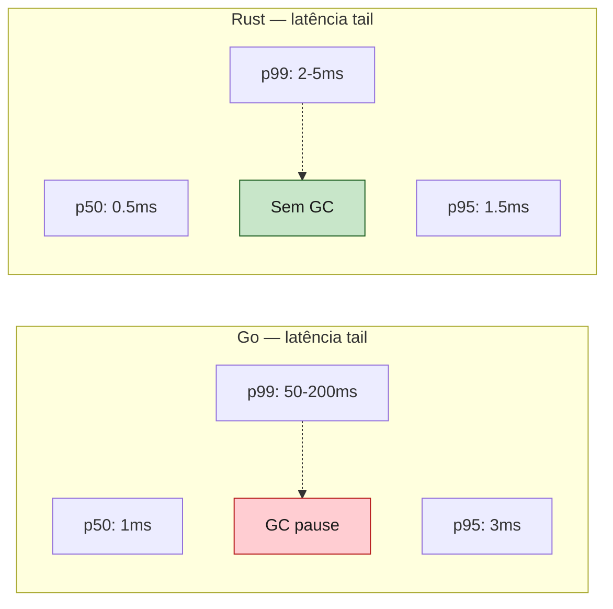
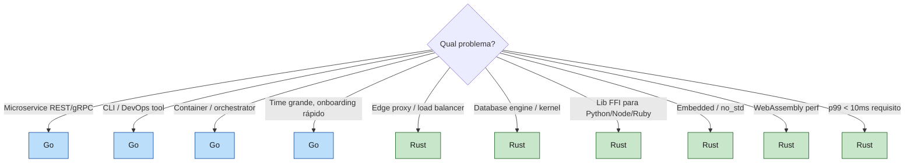

<a id="capitulo-54"></a>
# Capítulo 54: Rust vs Go — Concorrência, GC e Filosofia

> *"Less is exponentially more."*
> — Rob Pike, sobre Go

> *"Rust does not have a small surface area. It has a small surprise area."*
> — Niko Matsakis

## 54.1 Dois Filhos de 2009

Em 2009, dois projetos começavam quase simultaneamente, com o mesmo diagnóstico — *as linguagens de sistemas estão obsoletas* — e respostas opostas:

- **Go** (Google, novembro 2009): "vamos pegar o que C++ tem de pior, jogar fora, e adicionar GC + goroutines. O resto fica simples."
- **Rust** (Mozilla, julho 2010): "vamos provar em compile time que código de sistemas é seguro. Que se dane a simplicidade — queremos garantias."

Go ganhou tração mais rápido. Era mais fácil. Continua sendo mais fácil. Em 2026, Go é a linguagem padrão de orquestradores cloud (Kubernetes, Docker, Terraform, Prometheus, Consul, etcd). Rust é a linguagem padrão de tudo que precisa estar **abaixo** desses orquestradores (Firecracker, Pingora, kernel modules, Deno, edge runtimes).

Os dois são bons. Eles **não competem pelo mesmo problema**.

| Eixo | Go | Rust |
|---|---|---|
| GC | Sim, concurrente, ~ms pauses | Não tem |
| Concorrência | Goroutines stackful + channels | async/await stackless + traits Send/Sync |
| Data race detection | Runtime (com `-race`, opt-in) | Compile time (sempre) |
| Generics | 1.18+ (limitado, sem methods generic) | First-class, monomorphization |
| Error handling | `if err != nil` (manual) | `Result<T, E>` + `?` |
| Compile time | Rapidíssimo (segundos) | Lento (minutos para release) |
| Tooling | `go fmt`, `go test`, `go build` — minimalista | Cargo + clippy + rustfmt + workspaces |
| Curva de aprendizado | Dias | Meses |
| Sweet spot | Servidores de rede, CLIs, infra cloud | Sistemas, libs FFI, perf-crítico, embedded |

## 54.2 A Filosofia da Simplicidade Forçada

Go é deliberadamente pequeno. Rob Pike escreveu *"the language is simple enough to fit in a programmer's head"*. A consequência é que Go **se recusa a adicionar features** mesmo quando o time pede:

- Generics: 13 anos de discussão, adicionado em 2022 (1.18), ainda limitado
- Sum types / enums: rejeitados oficialmente
- Pattern matching: não tem
- Try/catch: rejeitado em favor do `if err != nil`
- Operator overloading: nunca
- Macros: nunca

Rust é o oposto. Rust tem tudo que dá pra ter sem GC:

- Generics + trait bounds + associated types + GATs
- Enums com payload (sum types) + match exhaustivo
- Macros (declarativas e procedurais)
- Operator overloading (via traits)
- Async/await + traits Send/Sync
- Lifetimes explícitos

**A controvérsia**: Go acredita que *programadores médios em times grandes* produzem mais quando a linguagem corta opções. Rust acredita que *programadores experientes em times menores* produzem mais quando a linguagem expressa intenção exatamente.

Ambos têm dados a seu favor. Google (Go) e Mozilla/Cloudflare (Rust) prosperam em escala. A escolha é cultural antes de técnica.

## 54.3 Concorrência — Stackful vs Stackless

Aqui mora a maior diferença técnica entre as duas. Vamos ver o mesmo programa nos dois.

### HTTP server simples

```go
// Go — net/http é stdlib, goroutines automáticas
package main

import (
    "fmt"
    "net/http"
)

func handler(w http.ResponseWriter, r *http.Request) {
    fmt.Fprintf(w, "Hello, %s!", r.URL.Path[1:])
}

func main() {
    http.HandleFunc("/", handler)
    http.ListenAndServe(":8080", nil)
    // Cada request roda numa goroutine. ~2-8KB de stack inicial.
    // Scheduler em runtime (M:N — N goroutines em M threads OS).
}
```

```rust
// Rust — async com Tokio
use axum::{routing::get, Router, extract::Path};

async fn handler(Path(name): Path<String>) -> String {
    format!("Hello, {name}!")
}

#[tokio::main]
async fn main() {
    let app = Router::new().route("/:name", get(handler));
    let listener = tokio::net::TcpListener::bind("0.0.0.0:8080").await.unwrap();
    axum::serve(listener, app).await.unwrap();
    // Cada request é uma Future. Zero stack — só uma struct no heap.
    // Scheduler do Tokio (work-stealing) executa milhões delas em N threads.
}
```

A diferença não está no código que você lê — está no **modelo de execução**:



**Stackful (Go)**: cada goroutine tem sua própria stack que cresce dinamicamente. Custa memória (mesmo que pouca). Permite chamar qualquer função sem cerimônia. O scheduler pode pre-emptar a goroutine em qualquer ponto.

**Stackless (Rust)**: cada Future é uma state machine compilada. Tamanho fixo, conhecido em compile time. Yields acontecem **só em `.await`** — cooperativo. Sem stack separada, sem context switch.

### Worker pool

```go
// Go — channels-first
package main

import (
    "fmt"
    "sync"
)

func worker(id int, jobs <-chan int, results chan<- int, wg *sync.WaitGroup) {
    defer wg.Done()
    for j := range jobs {
        results <- j * 2
    }
}

func main() {
    jobs := make(chan int, 100)
    results := make(chan int, 100)
    var wg sync.WaitGroup

    for w := 1; w <= 3; w++ {
        wg.Add(1)
        go worker(w, jobs, results, &wg)
    }

    for j := 1; j <= 5; j++ {
        jobs <- j
    }
    close(jobs)

    go func() { wg.Wait(); close(results) }()
    for r := range results {
        fmt.Println(r)
    }
}
```

```rust
// Rust — channels também, mas tipados e sem panic se receiver dropa
use tokio::sync::mpsc;

async fn worker(id: usize, mut jobs: mpsc::Receiver<i32>, results: mpsc::Sender<i32>) {
    while let Some(j) = jobs.recv().await {
        let _ = results.send(j * 2).await;
    }
}

#[tokio::main]
async fn main() {
    let (jobs_tx, jobs_rx) = mpsc::channel(100);
    let (results_tx, mut results_rx) = mpsc::channel(100);

    // 3 workers — mas só 1 pode receber do mesmo channel mpsc.
    // Para fan-out, usamos broadcast ou async-channel:
    let (jobs_tx, jobs_rx) = async_channel::bounded(100);

    let handles: Vec<_> = (1..=3).map(|id| {
        let rx = jobs_rx.clone();
        let tx = results_tx.clone();
        tokio::spawn(async move {
            while let Ok(j) = rx.recv().await {
                let _ = tx.send(j * 2).await;
            }
        })
    }).collect();

    for j in 1..=5 {
        jobs_tx.send(j).await.unwrap();
    }
    drop(jobs_tx);
    drop(results_tx);

    while let Some(r) = results_rx.recv().await {
        println!("{r}");
    }

    for h in handles { h.await.unwrap(); }
}
```

Go é mais curto. Rust é mais explícito sobre quem possui o quê — `clone()` no sender, `drop()` para fechar. **Go esconde a complexidade no runtime; Rust expõe no código.**

## 54.4 Data Races — Runtime vs Compile Time

Esse é o ponto onde Rust *sai na frente sem dúvida*.

```go
// Go — data race que COMPILA
package main

import (
    "fmt"
    "sync"
)

func main() {
    counter := 0
    var wg sync.WaitGroup
    for i := 0; i < 1000; i++ {
        wg.Add(1)
        go func() {
            defer wg.Done()
            counter++ // 💥 data race — duas goroutines escrevem
        }()
    }
    wg.Wait()
    fmt.Println(counter) // ~973, ~881, ~999 — não-determinístico
}

// `go run -race main.go` detecta em runtime.
// Mas só se a race ACONTECER no teste. Em CI 1000x sem trigger, pode passar.
```

```rust
// Rust — não compila
use std::thread;

fn main() {
    let mut counter = 0;
    let mut handles = vec![];
    for _ in 0..1000 {
        handles.push(thread::spawn(|| {
            counter += 1;  // ❌ erro de compilação
            //                cannot borrow `counter` as mutable
            //                more than once at a time
        }));
    }
    for h in handles { h.join().unwrap(); }
    println!("{counter}");
}

// Forma correta:
use std::sync::atomic::{AtomicUsize, Ordering};
let counter = AtomicUsize::new(0);
// ... thread::spawn(|| counter.fetch_add(1, Ordering::Relaxed))
// O TIPO te força a usar primitivo atômico.
```

Go race detector é um **tool de teste** — você precisa rodar com `-race`, e ele só pega races que de fato aconteceram durante a execução. Em produção, sem `-race` (porque tem overhead), você roda código que pode ter races latentes.

Rust pega em compile time, **sempre**. O sistema de tipos (Send/Sync, ownership) torna data races *impossíveis de expressar*. Você não escolhe ativar a checagem — ela está no idioma da linguagem.

> "Em Go, você pode escrever código concorrente errado que parece certo. Em Rust, código concorrente errado simplesmente não compila." — adaptado de Steve Klabnik

## 54.5 Performance e Latency Tail

Em throughput puro de CPU, Rust ganha. Em latency tail, Rust **destrói**.

### Throughput (relativo ao C como 100%)

| Linguagem | Tipicamente |
|---|---|
| C | 100% |
| Rust | 95-100% |
| Go | 70-85% |
| Java | 70-90% (após warmup JIT) |
| Node | 30-50% |

Go fica entre 70-85% de C em workloads CPU-bound. Não é ruim. Para a maioria dos serviços de rede, é mais que suficiente.

### Latency tail (p99)

Aqui é onde Go sangra. Toda runtime com GC tem o mesmo problema:



**Caso documentado: Discord (2020)**. O serviço *Read States* (qual mensagem você leu por última) era em Go. Discord publicou um post-mortem de migração pra Rust:
- p99 latency em Go: ~200ms (espigões em GC)
- p99 latency em Rust: ~3ms

A causa raiz não era código mal escrito — era o GC do Go ficando atrás de uma estrutura de dados grande. Em Rust, sem GC, p99 ficou colado em p50.

**Caso documentado: Cloudflare Pingora (2022)**. Substituiu NGINX (C) em proxy de borda. Não é Go, mas é um caso emblemático de Rust em prod servindo trilhões de requests:
- 70% menos uso de CPU
- 67% menos memória
- Conexões mais resilientes (graceful upgrade sem dropar)

Go *não é lento*. Go é rápido o suficiente para 95% dos serviços. Mas se você está nos 5% (fintech com SLA p99.9, edge proxy, trading, latency-sensitive), Rust é o caminho.

## 54.6 Tooling — Cargo vs go

Aqui Go ganha em **simplicidade**, Rust ganha em **poder**.

### Go

```bash
go mod init github.com/user/proj   # cria go.mod
go get github.com/x/y               # adiciona dep
go build ./...                       # compila tudo
go test ./...                        # testa tudo
go fmt ./...                         # formata
go vet ./...                         # lint básico
```

Cinco comandos. Sem flags na maioria dos casos. `go fmt` é *o* formatador — não tem alternativa, não tem config. Você abre código Go de qualquer projeto e parece o mesmo código.

### Rust

```bash
cargo new proj                       # cria projeto
cargo add tokio                       # adiciona dep
cargo build                           # debug build
cargo build --release                 # otimizado
cargo test                            # testes
cargo fmt                             # formata (rustfmt)
cargo clippy                          # lint avançado (~600 lints)
cargo doc --open                      # gera docs
cargo bench                           # benchmarks
cargo workspaces                      # multi-crate
cargo audit                           # vulnerabilidades
```

Cargo é mais poderoso. Workspaces, features condicionais (`#[cfg(feature = "x")]`), profiles (debug/release/test/bench), build scripts — tudo em um único `Cargo.toml`. Mas a curva é maior.

**Veredito honesto**: para iniciantes, Go ganha de longe. Para projetos complexos com múltiplos crates, plataformas, e feature flags, Cargo é insuperável.

## 54.7 Erro: Manual vs `?`

Go fez uma aposta polêmica: zero ceremony em erros.

```go
// Go — manual, repetitivo, mas claro
func loadUser(id string) (*User, error) {
    raw, err := db.Get(id)
    if err != nil {
        return nil, fmt.Errorf("get user %s: %w", id, err)
    }
    user, err := parse(raw)
    if err != nil {
        return nil, fmt.Errorf("parse user: %w", err)
    }
    return user, nil
}
```

```rust
// Rust — propagação automática com ?
fn load_user(id: &str) -> Result<User, MyError> {
    let raw = db_get(id)?;
    let user = parse(&raw)?;
    Ok(user)
}

// Com contexto via anyhow ou thiserror:
use anyhow::Context;
fn load_user(id: &str) -> anyhow::Result<User> {
    let raw = db_get(id).with_context(|| format!("get user {id}"))?;
    let user = parse(&raw).context("parse user")?;
    Ok(user)
}
```

Go tem 3-5 linhas de boilerplate por erro. Rust tem 1 caractere (`?`). Multiplique por mil funções. A diferença em densidade de código é dramática.

Mas: Go *é mais explícito* sobre onde erros podem acontecer. Você lê linha a linha e vê. Em Rust, o `?` esconde o controle de fluxo num símbolo. **Os dois lados argumentam que o seu é mais legível.** É preferência.

## 54.8 Quando Cada Um Brilha



**Go ganha em:**
- Velocidade de iteração (compile time absurdamente rápido)
- Onboarding (devs novos produtivos em dias)
- Stdlib pra rede (net/http, encoding/json — tudo lá)
- Deploy (binário estático, sem runtime)
- Cloud-native (k8s, docker, terraform — tudo Go)

**Rust ganha em:**
- Performance previsível (sem GC pauses)
- Segurança de memória + concorrência em compile time
- FFI (chamado de Python/Node/Ruby/Java — PyO3, napi-rs)
- Embedded (`no_std`, sem alocação)
- WebAssembly (binário pequeno, sem runtime pesado)
- Sistemas onde correctness > velocidade de dev

## 54.9 O Caso Híbrido

Times maduros usam **os dois**. Padrão emergente desde 2022:

- **Go**: APIs externas, BFF, CRUD, jobs de orquestração
- **Rust**: hot paths internos chamados via gRPC/IPC

Exemplos:
- **Discord**: Elixir/Go para API, Rust para Read States e voice gateways
- **Cloudflare**: Go pra control plane, Rust pra data plane (Pingora, Workers runtime)
- **AWS**: Go pra ferramentas (ECS CLI), Rust pra Firecracker e Bottlerocket
- **1Password**: TypeScript pra UI, Rust pro core de criptografia

A regra empírica: **Go onde produtividade > microsegundos. Rust onde microsegundos > produtividade.**

## 54.10 Conclusão — Sem Vencedor, Só Encaixe

Go e Rust são as duas linguagens de sistemas que merecem atenção em 2026. Não são rivais — são **especialistas em problemas diferentes**.

Go é a melhor linguagem da história para *escrever um servidor de rede em uma tarde*. Rust é a melhor linguagem da história para *escrever um sistema que precisa rodar 10 anos sem incidente*.

Go te ensina que simplicidade na linguagem produz produtividade no time. Rust te ensina que rigor na linguagem produz garantias no produto. As duas lições são verdadeiras, mas operam em escalas de tempo diferentes — Go ganha no sprint, Rust ganha na década.

Se você é um dev TS/Node lendo este capítulo: **aprenda os dois**. Go vai te dar produtividade imediata em backends. Rust vai te dar a base para entender o que está abaixo do runtime que você usa todo dia. Os dois juntos te tornam o tipo de engenheiro que não precisa pedir desculpa por nenhuma escolha técnica.

> *"Go e Rust são as duas linguagens que tomaram a sucessão de C/C++ a sério. Uma trocou simplicidade por GC. A outra trocou GC por rigor. As duas estão certas — para problemas diferentes."*

[Próximo: Capítulo 55 — Rust vs C: A Sucessão Evolutiva →](ch55-rust-vs-c.md)
