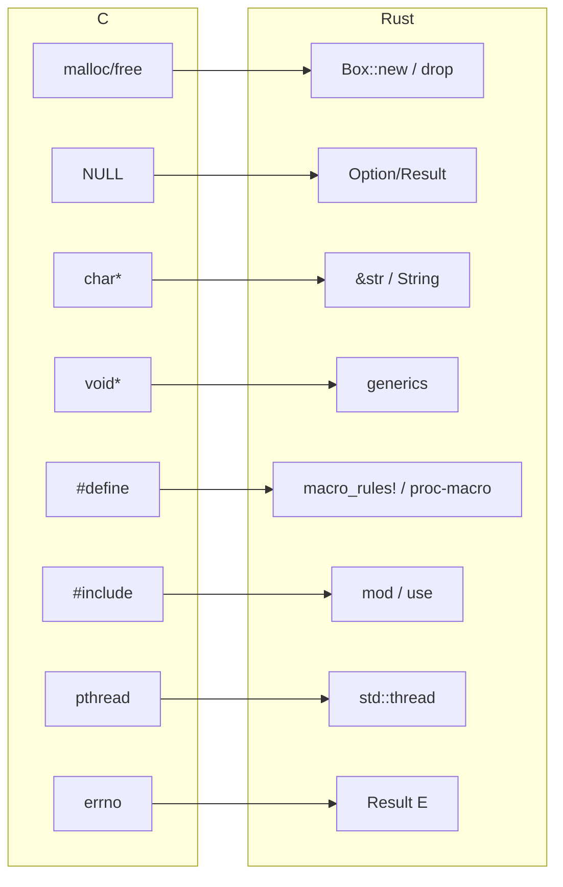

<a id="capitulo-55"></a>
# Capítulo 55: Rust vs C — A Sucessão Evolutiva

> *"C is quirky, flawed, and an enormous success."*
> — Dennis Ritchie, criador de C

> *"Rust é a primeira linguagem que pode dizer 'eu sou C, mas com 50 anos de lições incorporadas' sem mentir."*

## 55.1 O Peso de Cinquenta Anos

C foi anunciada em 1972. Tem mais de meio século. Rodou em mainframes, em microcontroladores de oito bits, em estações de trabalho, em telefones, em foguetes. Escreveu o Unix, o Linux, o Windows, todos os browsers, todos os bancos de dados sérios, todos os runtimes (incluindo o de TypeScript, Go, Java).

Substituir C não é um exercício acadêmico. É uma operação cardíaca em uma pessoa que ainda está correndo a maratona.

## 55.2 O Que C Acertou

Antes de criticar, é honesto reconhecer:

- **Modelo de memória transparente**: cada byte sob seu controle. Para sistemas de baixíssimo nível, é necessário.
- **Compilação rápida**: décadas de otimização tornaram `gcc` e `clang` extraordinariamente eficientes.
- **Portabilidade**: C roda em arquiteturas que Rust ainda não suporta nativamente.
- **ABI estável e universal**: cada linguagem em existência sabe falar com C. Esse é o preço de ser primeiro.
- **Simplicidade conceitual**: K&R inteiro tem 272 páginas. A linguagem cabe na cabeça.

C não é ruim. C é antiga, e algumas das suposições de 1972 não envelheceram bem.

## 55.3 O Que C Errou

A lista de feridas é longa, e cada item custou bilhões em produção:

| Defeito | Custo |
|---|---|
| **Null como valor universal de ponteiro** | Tony Hoare chamou de "billion dollar mistake". Cada `NULL` deref ainda derruba serviço. |
| **Strings sem comprimento (`char*`)** | Buffer overflows, off-by-one, encoding indefinido. Heartbleed, Stagefright, Code Red — todos vieram daqui. |
| **`malloc`/`free` manual** | Use-after-free, double-free, leaks. 70% das CVEs em Microsoft e Google são memory bugs. |
| **Tipos numéricos com tamanho indefinido** | `int` é 16 bits? 32? 64? Depende do compilador e da plataforma. Bugs portáteis. |
| **Coerção implícita** | `int x = -1; if (x < sizeof(arr))` — `sizeof` é unsigned, `x` é promovido, condição é falsa. Bug clássico. |
| **Preprocessor textual** | `#define` sem hygiene. `#define MIN(a,b) ((a)<(b)?(a):(b))` chamado com `MIN(i++, j++)` é UB. |
| **Sem namespaces, sem módulos** | Tudo é global. Conflitos resolvidos por convenções (`prefix_`). |
| **Concorrência depois do fato** | `pthread` é uma API enxertada. Sem garantias de linguagem. |
| **Undefined behavior em todo lugar** | Compilador pode assumir que UB nunca ocorre — e otimizar baseado nisso. Bugs viram CVEs com publicidade. |

Cada item desta lista corresponde a uma decisão deliberada de Rust *no sentido oposto*.

## 55.4 Tradução Direta: C → Rust

```c
// C
#include <stdio.h>
#include <stdlib.h>
#include <string.h>

int main() {
    char* nome = malloc(20);
    strcpy(nome, "Felipe");
    printf("%s\n", nome);
    free(nome);
    // Esqueci de free? Leak. Free duas vezes? Crash. Use após free? CVE.
    return 0;
}
```

```rust
// Rust
fn main() {
    let nome = String::from("Felipe");
    println!("{}", nome);
    // String é dropped no fim do escopo. Automaticamente. Uma vez. Sem custo extra.
}
```

Mesma performance. Mesmo controle. Sem `malloc`/`free` para esquecer. Sem `strcpy` para estourar. Sem `printf` format string para explorar (formato é compilado).

## 55.5 Mapa de Conceitos



Cada construção de C tem sucessor em Rust — e o sucessor é mais expressivo, mais seguro, e na maioria das vezes igualmente ou mais rápido.

## 55.6 Performance: Empate

Em benchmarks honestos, Rust e C ficam dentro de 1-3% um do outro. Quem ganha varia caso a caso. Razões:

- **Mesmo backend**: ambos usam LLVM. As otimizações são idênticas.
- **Mesmo modelo de memória**: zero overhead, layout previsível.
- **Diferenças marginais**: Rust faz bound checks por default em arrays (que LLVM frequentemente elimina); C tem `restrict` enquanto Rust deduz aliasing (vantagem Rust em alguns casos); inlining de generics monomorphizadas vs polimorfismo void-pointer em C.

Quem pede "Rust deveria ser mais rápido que C porque tem mais info de aliasing" e "C deveria ser mais rápido que Rust porque não tem bounds check" estão ambos certos em casos específicos. Em média: empate técnico.

## 55.7 Onde C Ainda Resiste

C continua dominante em:

- **Kernels históricos**: Linux ainda é majoritariamente C (Rust permitido desde 6.1, mas só em subsystems específicos).
- **Embedded sem `alloc`**: muitos chips de 8/16 bits têm compiladores Rust experimentais; em C há ferramentas estáveis há décadas.
- **APIs ABI universais**: toda lib que precisa ser chamada de Python, Java, Ruby, Go, JS exporta C ABI. Rust exporta o mesmo via `extern "C"`, mas a *interface descritora* (header `.h`) é cultural de C.
- **Plataformas exóticas**: arquiteturas raras (DSPs específicos, MCUs proprietários) têm `gcc` mas não `rustc`.
- **Legado**: bilhões de linhas em produção. A barreira não é técnica, é organizacional.

## 55.8 Onde Rust Já Venceu

- **Systems programming novo**: novas ferramentas (databases, servidores de proxy, runtimes) escolhem Rust quando podem.
- **Drivers**: Linux 6.1+ aceita drivers Rust. Apple GPU driver é Rust. NVIDIA Open driver é parcialmente Rust.
- **Browsers**: Servo (Mozilla) provou; partes do Firefox são Rust; Chromium experimenta.
- **Cryptographic primitives**: RustCrypto é um ecossistema mais saudável que LibreSSL/OpenSSL — segurança crítica, sem heartbleeds.
- **Network proxies**: Cloudflare Pingora (substituiu NGINX em parte da infra), Discord Read States (substituiu Go).
- **Embedded com `alloc`**: ARM Cortex-M, RISC-V — Rust embedded é maduro o suficiente para produção.

## 55.9 Migração: Como Acontece na Prática

Reescrever C em Rust de uma vez é raramente realista. As migrações reais seguem três padrões:

**1. Strangler Fig**: Rust escreve módulos novos, expostos via FFI para o C antigo. C lentamente é descomissionado.

**2. Component-by-component**: subsystems específicos são reescritos. Exemplo: Pingora substituiu NGINX para alguns casos de uso, deixando NGINX nos outros.

**3. Greenfield**: novos projetos começam Rust. Sem migração — substituição por relevância.

A combinação desses três é o que está erodindo a hegemonia de C. Não em revolução, mas em sucessão geracional.

## 55.10 O Que C Ensina Que Rust Honra

Rust não é "C melhorado". Há diferenças filosóficas profundas:

- C diz: *"você é o adulto na sala, eu não te atrapalho"*.
- Rust diz: *"o adulto na sala é o compilador, e ele te ajuda a não cair"*.

C tem clareza brutal — você lê um pedaço de C e sabe exatamente que código de máquina sai. Rust tem mais magia (generics, monomorphization, drop implícito), e isso custa transparência. Para alguns domínios (firmware crítico, escrita de allocators), essa transparência ainda é argumento.

Mas o saldo histórico é claro: a maior parte do que precisamos escrever hoje *não precisa* dessa transparência total. Precisa de **garantias**. E Rust as oferece.

## 55.11 Tabela Final

| Critério | C | Rust |
|---|---|---|
| Memory safety | Não | Sim (em safe) |
| Ownership tracking | Manual | Compilador |
| Concorrência segura | Não | Sim |
| Error handling | errno + return code | Result |
| Null safety | Não | Option |
| Generics | Macros / void* | Monomorphization |
| Module system | `#include` textual | `mod` + `use` |
| Package manager | Make, Autotools, CMake | Cargo |
| ABI stability | Universal | Não estável (mas exporta C) |
| Compile time | Rápido | Lento |
| Tooling | Fragmentado | Cargo + rustfmt + clippy + rust-analyzer |
| Curva de aprendizado | Sintaxe simples, semântica perigosa | Sintaxe complexa, semântica segura |
| Ecossistema | Maduro, espalhado | Crescendo, centralizado em crates.io |

## 55.12 O Que Vem Depois

C não vai desaparecer. Vai durar décadas — talvez tanto quanto Cobol durou no banco. Mas o **código novo** está migrando, e o ritmo está se acelerando.

A pergunta não é mais *"Rust pode substituir C?"*. É *"em quanto tempo a maioria do código novo de sistemas será Rust?"*. A resposta provável: nesta década.

---

> *"C foi a linguagem-mãe da computação moderna. Rust é a primeira sucessora honesta — não nega a herança, paga a dívida histórica."*

[← Capítulo 54 — Rust vs Go](ch54-rust-vs-go.md) | [Próximo: Capítulo 56 — Quando Não Rust →](ch56-quando-nao-rust.md)
