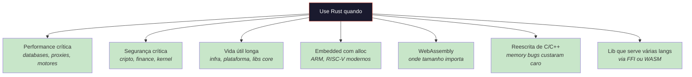
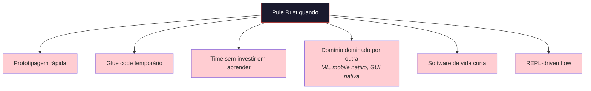

# Capítulo 56: Quando *Não* Escolher Rust

> *"Use the right tool for the job. Don't bring a chainsaw to butter your toast."*
> — Aforismo de engenharia

> *"O entusiasta diz: use Rust para tudo. O engenheiro diz: use Rust quando Rust é o melhor — e tenha humildade para o resto."*

## 56.1 A Honestidade Necessária

Este livro inteiro defendeu Rust. Defendeu bem, eu espero. Mas defender uma linguagem sem reconhecer suas falhas é evangelismo, não engenharia. Há domínios inteiros onde Rust é a escolha errada — não por imaturidade, mas por desenho.

Este capítulo é a contrapartida: quando *não* escolher Rust, e o que escolher no lugar.

## 56.2 Quando Você Está Prototipando

Se o objetivo é descobrir o problema antes de resolver, Rust te atrasa. O borrow checker, os tipos, a `?`-propagation — tudo isso é benefício *depois* que você sabe o que quer construir. Antes disso, é fricção.

Para esse domínio:

- **Python** se você está investigando dados, ML, ou problemas matemáticos.
- **TypeScript** se há UI envolvida.
- **Go** se você quer concorrência simples sem se importar com perfomance fina.

Quando o protótipo virar produto, considere reescrever os hot paths em Rust. Não o app inteiro.

## 56.3 Quando o Compile Time Importa Mais Que Runtime

Rust é lenta para compilar. Builds limpas de projetos médios (50 mil linhas) levam minutos. Projetos grandes (centenas de milhares) levam dezenas de minutos. Mesmo com cache (`cargo check`, incremental), o ciclo edit-test é mais lento que TS, Go ou Python.

Para serviços que rebooteiam frequentemente em desenvolvimento (servers, scripts CLI experimentais), considere:

- **Go**: compila em segundos mesmo para projetos grandes.
- **TypeScript**: `tsx`/`bun` rodam direto sem build separado.
- **Python**: zero compile time.

Se você gasta mais tempo esperando build do que codando, a linguagem está errada para o contexto.

## 56.4 Quando Seu Time Não Pode Investir Seis Meses

Rust tem curva. Programadores sêniores em outras linguagens levam de 3 a 6 meses até serem produtivos em Rust idiomático. Lutar com o borrow checker, aprender quando usar `Arc<Mutex<T>>` vs `RwLock`, entender `Pin` para async — tudo isso custa.

Se seu time:
- Tem deadline de 6 semanas para um produto.
- Não tem ninguém com experiência prévia em Rust.
- Não pode investir em pareamento e mentoria.

Use o que o time já sabe. Migre depois, se valer a pena.

## 56.5 Quando o Domínio Tem Ecossistema Muito Melhor em Outra Linguagem

Esta é a regra mais subestimada. Linguagens não competem só em sintaxe — competem em bibliotecas e comunidade.

| Domínio | Linguagem dominante | Por quê |
|---|---|---|
| **Data science / ML training** | Python | NumPy, PyTorch, scikit-learn, pandas — décadas de investimento |
| **Mobile nativo (iOS)** | Swift | Suporte oficial Apple, melhor experiência |
| **Mobile nativo (Android)** | Kotlin | Suporte oficial Google, integração JVM |
| **Enterprise Java** | Java/Kotlin | Ecossistema Spring, JVM, jobs prontos |
| **Game engines AAA** | C++ | Unreal, libs de física, motores prontos |
| **Salesforce / SAP / ERP** | Apex / ABAP | Plataformas fechadas |
| **Scripting de SO** | Bash / PowerShell | Built-in, glue universal |
| **Plugins WordPress** | PHP | É o ecossistema |

Em todos esses, Rust pode ser usado para *partes* (o motor de inferência sob a API Python, o serviço HTTP que serve ao Java, o WASM que vive no navegador junto ao TS), mas raramente é a linguagem principal.

## 56.6 Quando Você Está Escrevendo Glue Code

Glue code é código que não tem performance crítica, não tem segurança crítica, e existe para juntar APIs umas com as outras. Lê de uma fila, transforma JSON, chama outra API, escreve em banco. Milhares desses scripts vivem em produção.

Para glue:
- **Python** ou **TypeScript** te dão produtividade alta, ecossistema imenso, deploy fácil.
- **Go** se você quer um binário standalone sem runtime extra.

Rust pode fazer, mas o ROI é baixo. O custo de cada linha (mut, ?, Result, lifetimes) supera o benefício quando o código vai rodar três vezes por dia.

## 56.7 Quando GUI Nativa Madura é o Requisito

GUI em Rust ainda é fronteira. As opções estão evoluindo rápido — `Slint`, `egui`, `iced`, `Tauri`, `Dioxus Desktop` — mas nenhuma rivaliza com a maturidade de:

- **Swift/SwiftUI** para macOS/iOS.
- **Kotlin/Compose** para Android/desktop.
- **Flutter** (Dart) para multi-plataforma com design único.
- **Electron** (TS) para apps cross-platform com bundling pesado mas pronto.
- **Qt** (C++) para apps profissionais com 20 anos de polimento.

Se a UI é o produto, escolha uma stack onde a UI é cidadã de primeira classe. Tauri é uma exceção interessante (Rust no backend, web view no front), mas é solução híbrida.

## 56.8 Quando Você Precisa de Iteração Live ou REPL

Rust não tem REPL produtivo. `evcxr` existe e funciona, mas é experimental. Para fluxos onde você quer interagir com o código em execução — debugging interativo, exploração de dados, pedagogia — Rust frustra.

Para isso:
- **Python**, **Julia**, **R** brilham.
- **TypeScript** via `node --watch` ou Deno tem boa iteração.
- **Clojure**, **Lisp** são imbatíveis em REPL-driven development.

## 56.9 Quando o Custo da Curva Aprendida Não Se Recupera

Imagine um software que vai viver 6 meses, ser tocado por 2 pessoas, e processar volumes baixos. O custo de aprender Rust nunca se paga. Use Python, TypeScript, ou Go.

Imagine o oposto: um software de infra crítica, vida útil de 10 anos, time de 30 pessoas, processando bilhões de eventos por dia. Aqui Rust é provavelmente vencedor: o custo de aprendizado se dilui, e os benefícios de segurança e performance se acumulam.

A questão não é se Rust é "boa". É se vai sobreviver à divisão *(custo de adoção) / (benefício acumulado ao longo da vida do projeto)*.

## 56.10 Onde Rust *é* a Escolha Certa

Para fechar com balanço:

E **não** use Rust quando:

## 56.11 A Pergunta Honesta

Antes de escolher Rust para um projeto, faça três perguntas — em voz alta, com a equipe:

1. **Qual o pior bug aceitável neste sistema?** Se "tudo bem panicar e reiniciar", Rust pode ser overkill. Se "uma race condition derruba 5 milhões de dólares", Rust se justifica.
2. **Quanto tempo este código vai viver?** Custo de aprendizado é fixo; benefícios são proporcionais à vida útil.
3. **Onde o time já é forte?** Linguagem nova é multiplicador *negativo* nos primeiros 6 meses.

Se as respostas alinham com o que Rust oferece, vá. Se não, escolha o que serve.

## 56.12 O Mínimo de Maturidade

Rust não é religião. É ferramenta. Boas ferramentas são escolhidas pelo problema, não pelo orgulho do artesão.

Os melhores Rustaceans que conheço usam Python para ML, TypeScript para front, Go para serviços simples, e Rust onde Rust importa. Eles não defendem Rust em todos os fóruns. Eles escolhem Rust quando a escolha é acertada — e dormem melhor por isso.

---

> *"Saber quando uma linguagem não serve é a metade adulta de saber por que ela serve."*

[← Capítulo 55 — Rust vs C](ch55-rust-vs-c.md) | [Próximo: Capítulo 57 — Embedded e no_std →](../part-20-frontiers/ch57-embedded-no-std.md)
