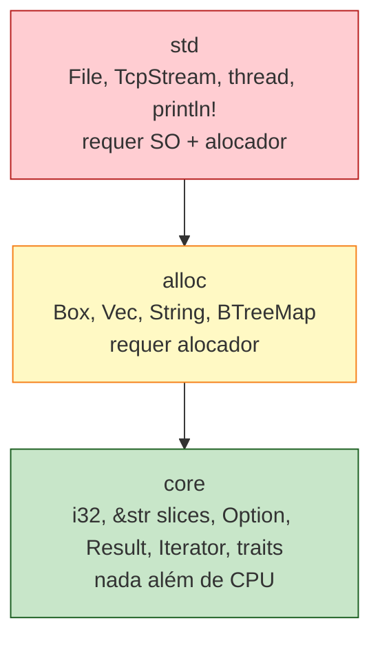

<a id="capitulo-57"></a>
# Capítulo 57: Embedded Rust e `no_std`

> *"There is no cloud. It's just someone else's computer."*
> — folclore da indústria

> *"E aquele computador, no fim das contas, é um microcontrolador com 16 KB de RAM rodando código que ninguém quer revisar."*
> — corolário honesto

## 57.1 O Mundo Sem `std`

A `std` é um luxo. Você cresceu com ela e provavelmente não percebeu o tamanho dela. `String`, `Vec`, `HashMap`, `File`, `TcpStream`, threads, sincronização, `println!` — tudo isso assume três coisas que um microcontrolador de US$ 2 não tem:

1. **Um sistema operacional** que ofereça syscalls (`write`, `mmap`, `clock_gettime`).
2. **Um alocador de memória** capaz de pedir páginas ao kernel.
3. **Mais do que alguns kilobytes** de RAM e flash.

O atributo `#![no_std]` é a forma de Rust dizer ao compilador: *eu vou rodar num lugar onde nada disso existe*. O que sobra, depois que você desliga `std`, é uma linguagem ainda completa — mas que precisa ser tratada com a mesma seriedade de um C bem escrito, com a vantagem de que o borrow checker continua trabalhando.

```rust
#![no_std]
#![no_main]

use panic_halt as _;

#[cortex_m_rt::entry]
fn main() -> ! {
    let mut counter: u32 = 0;
    loop {
        counter = counter.wrapping_add(1);
        cortex_m::asm::nop();
    }
}
```

Quatro linhas que dizem muita coisa. `#![no_std]` desliga a biblioteca padrão. `#![no_main]` desliga o `main` que normalmente o crate `std` instala (que faz argv parsing, setup de stdio, panic handling). `panic_halt` é um *crate-policy* — ele define o que acontece quando algo dá `panic!`. Sem ele, o linker reclama de símbolo faltante. E `loop {}` com retorno `!` é a marca de um programa que não termina: um firmware roda até a placa ser desligada.

## 57.2 `core`, `alloc`, `std` — A Pirâmide

Rust não é uma única biblioteca padrão. São três, em camadas, e quase ninguém aprende isso nos tutoriais.



`core` é a fundação. Tipos primitivos, traits fundamentais (`Iterator`, `Clone`, `Copy`, `Debug`), `Option`, `Result`, slices, formatação. **Nada** que precise de heap. **Nada** que precise de sistema operacional. Você consegue rodar `core` num CPU sem RAM dinâmica e sem clock.

`alloc` adiciona estruturas que vivem no heap: `Box<T>`, `Vec<T>`, `String`, `BTreeMap<K, V>`, `Rc<T>`, `Arc<T>`. Para usar `alloc`, você precisa registrar um **global allocator**. Em targets bare-metal isso costuma ser uma instância de `linked_list_allocator` ou `embedded-alloc` apontando para uma região de RAM reservada no linker script.

```rust
#![no_std]

extern crate alloc;

use embedded_alloc::Heap;

#[global_allocator]
static HEAP: Heap = Heap::empty();

fn init_heap() {
    use core::mem::MaybeUninit;
    const HEAP_SIZE: usize = 8 * 1024; // 8 KB
    static mut HEAP_MEM: [MaybeUninit<u8>; HEAP_SIZE] = [MaybeUninit::uninit(); HEAP_SIZE];
    unsafe { HEAP.init(HEAP_MEM.as_ptr() as usize, HEAP_SIZE) }
}
```

Note o tamanho: oito kilobytes. Não é um typo. Isso é tudo o que o seu `Vec`, suas `String`s, todas as alocações de runtime vão dividir. Se você empilhar três fontes de string em UTF-8 num display, já gastou metade.

`std` é o topo: arquivos, sockets, threads, processo. Você só tem `std` quando há um sistema operacional debaixo — Linux, macOS, Windows, ou um RTOS que exponha POSIX. Microcontroladores de classe Cortex-M, RISC-V de baixo consumo, AVR — todos rodam *bare metal* ou sob um RTOS minimalista, e portanto **sem `std`**.

A regra prática:

| Plataforma | `core` | `alloc` | `std` |
|---|---|---|---|
| Cortex-M0/M3/M4/M7 (STM32, nRF52, RP2040) | sim | opcional, com allocator | não |
| ESP32 (Xtensa/RISC-V) | sim | sim | sim, com `esp-idf-hal` |
| Linux embarcado (Yocto, Buildroot) | sim | sim | sim |
| AVR (Arduino Uno) | parcial | difícil | não |
| Tock OS, RTIC, Embassy | sim | depende da app | não |

## 57.3 Targets e a Triplet

`rustc` compila para uma *target triple*: arquitetura, vendor, OS, ABI. Para desktop você quase nunca pensa nisso — `cargo build` usa a target nativa. Para embedded, a triplet **é a configuração**.

```bash
rustup target add thumbv7em-none-eabihf
cargo build --target thumbv7em-none-eabihf --release
```

Decifrando `thumbv7em-none-eabihf`:

- **`thumb`** — modo Thumb (instruções de 16 bits) do ARM, padrão em Cortex-M.
- **`v7em`** — ARMv7E-M, com extensões DSP (Cortex-M4, M7).
- **`none`** — sem sistema operacional. Bare metal.
- **`eabihf`** — Embedded ABI com FPU em hardware (`hf` = hard-float).

Outras triplets comuns:

| Triple | CPU | Onde aparece |
|---|---|---|
| `thumbv6m-none-eabi` | Cortex-M0/M0+ | RP2040, nRF51 |
| `thumbv7m-none-eabi` | Cortex-M3 | STM32F1 |
| `thumbv7em-none-eabihf` | Cortex-M4F/M7F | STM32F4/F7, nRF52840 |
| `riscv32imac-unknown-none-elf` | RISC-V 32 | ESP32-C3, GD32V |
| `xtensa-esp32-none-elf` | Xtensa LX6 | ESP32 original |
| `avr-unknown-gnu-atmega328` | AVR 8-bit | Arduino Uno |

A escolha da triplet determina o conjunto de instruções, a presença de FPU, e qual *Hardware Abstraction Layer (HAL)* você consegue usar.

## 57.4 `embedded-hal` — A Trait que Salvou o Ecossistema

Em C embedded, cada vendor tem sua própria SDK. STM32 tem HAL Cube. Nordic tem nRF SDK. Espressif tem ESP-IDF. Cada uma com tipos, prefixos, convenções e bugs distintos. Reusar driver entre vendors é, na prática, impossível — o código de um sensor I²C escrito para STM32 precisa ser reescrito para nRF.

Rust resolveu isso da forma que Rust resolve tudo: **traits**.

`embedded-hal` é um crate que define *interfaces genéricas* para periféricos: GPIO, I²C, SPI, UART, ADC, PWM, timers. Cada vendor implementa essas traits no seu HAL específico. O driver do sensor escreve apenas contra a trait — e funciona em qualquer chip que a implemente.

```rust
use embedded_hal::i2c::I2c;

pub struct Bme280<I> {
    i2c: I,
    address: u8,
}

impl<I, E> Bme280<I>
where
    I: I2c<Error = E>,
{
    pub fn new(i2c: I, address: u8) -> Self {
        Self { i2c, address }
    }

    pub fn read_temperature(&mut self) -> Result<f32, E> {
        let mut buf = [0u8; 3];
        self.i2c.write_read(self.address, &[0xFA], &mut buf)?;
        let raw = ((buf[0] as i32) << 12)
            | ((buf[1] as i32) << 4)
            | ((buf[2] as i32) >> 4);
        Ok(raw as f32 / 5120.0)
    }
}
```

Esse driver compila e funciona em STM32, em RP2040, em ESP32, em nRF52, em qualquer chip onde `embedded-hal::i2c::I2c` esteja implementado. Genéricos com trait bounds são *zero-cost*: monomorfização gera, em tempo de compilação, uma versão específica para cada hardware, sem dispatch dinâmico, sem alocação, sem virtualização.

Esse padrão — definir traits genéricas e deixar o vendor implementar — é o que permitiu o ecossistema embedded de Rust crescer mais rápido que o de C. Mais de 300 drivers de sensores, displays, rádios, e periféricos no `crates.io` portam-se gratuitamente entre placas.

## 57.5 Embassy — Async num Microcontrolador

Eis a surpresa que mais incomoda quem vem de C embedded: **Rust roda `async/await` num microcontrolador de 16 KB**. E não é gambiarra. É um dos paradigmas mais elegantes de concorrência embedded já criados.

A intuição é simples. Em um microcontrolador você não tem threads — não há kernel para escalonar. Mas você tem *interrupts* (timers, GPIOs, periféricos) e *event loops*. Async/await em Rust é, no fundo, uma forma de transformar código sequencial em **state machines** que cedem controle em pontos explícitos. Casa exatamente com o modelo de execução de um MCU.

```rust
#![no_std]
#![no_main]

use embassy_executor::Spawner;
use embassy_rp::gpio::{Level, Output};
use embassy_time::{Duration, Timer};
use {defmt_rtt as _, panic_probe as _};

#[embassy_executor::task]
async fn blinker(mut led: Output<'static>) {
    loop {
        led.set_high();
        Timer::after(Duration::from_millis(500)).await;
        led.set_low();
        Timer::after(Duration::from_millis(500)).await;
    }
}

#[embassy_executor::main]
async fn main(spawner: Spawner) {
    let p = embassy_rp::init(Default::default());
    let led = Output::new(p.PIN_25, Level::Low);
    spawner.spawn(blinker(led)).unwrap();

    loop {
        Timer::after(Duration::from_secs(1)).await;
        // outra task qualquer
    }
}
```

`Timer::after(...).await` não bloqueia o CPU. Ele cede controle ao executor do Embassy, que coloca o MCU em *low-power sleep* até que um timer hardware dispare a interrupt. Energia gasta enquanto espera: praticamente zero. Em comparação, um `delay_ms` em C tradicional gira o CPU em loop, queimando bateria.

Embassy implementa um runtime async **sem heap obrigatório**. Tasks são alocadas estaticamente em tempo de compilação. O executor é uma fila de tarefas prontas, drenada num loop principal que dorme entre interrupts. O tamanho do binário fica em torno de 20-50 KB para projetos não-triviais.

A revelação aqui é que async/await — uma feature que quase todo mundo aprende para escrever servidores HTTP em Tokio — é igualmente útil para escrever firmware de um sensor BLE alimentado por bateria. Mesma sintaxe, mesma ergonomia, mesmo modelo mental. Dois domínios separados por seis ordens de magnitude de RAM unificados pela mesma abstração.

## 57.6 RTIC — Concorrência por Interrupções

O caminho alternativo a Embassy é o **RTIC** (Real-Time Interrupt-driven Concurrency). Em vez de async, RTIC usa o que o hardware ARM Cortex-M já oferece: **NVIC** (Nested Vectored Interrupt Controller) com prioridades. Tasks em RTIC são funções associadas a interrupts, e a análise estática garante ausência de data race em tempo de compilação.

```rust
#[rtic::app(device = stm32f4xx_hal::pac, dispatchers = [USART1])]
mod app {
    use stm32f4xx_hal::{prelude::*, gpio::*, pac};

    #[shared]
    struct Shared {
        counter: u32,
    }

    #[local]
    struct Local {
        led: gpioa::PA5<Output<PushPull>>,
    }

    #[init]
    fn init(ctx: init::Context) -> (Shared, Local) {
        let dp = ctx.device;
        let gpioa = dp.GPIOA.split();
        let led = gpioa.pa5.into_push_pull_output();
        (Shared { counter: 0 }, Local { led })
    }

    #[task(binds = TIM2, shared = [counter], local = [led], priority = 2)]
    fn tick(mut ctx: tick::Context) {
        ctx.shared.counter.lock(|c| *c += 1);
        ctx.local.led.toggle();
    }

    #[task(shared = [counter], priority = 1)]
    async fn report(mut ctx: report::Context) {
        let n = ctx.shared.counter.lock(|c| *c);
        defmt::info!("count = {}", n);
    }
}
```

A mágica: `Shared { counter }` é compartilhado entre tasks de prioridades diferentes. RTIC usa a regra **Stack Resource Policy** — recursos compartilhados só podem ser acessados por meio de `lock`, que eleva temporariamente a prioridade da task atual ao nível do recurso. Como ARM Cortex-M garante que nenhuma task de prioridade igual ou menor pode preemptar, **data race é impossível**. Isso é provado pelo borrow checker no momento da compilação. Não é runtime check. Não é convenção. É o sistema de tipos.

Embassy e RTIC convivem. Embassy é mais genérico, mais portável (roda em chips sem NVIC), e mais ergonômico. RTIC é mais determinístico, mais previsível em latência, e melhor para hard real-time. Um sistema de controle de motor de drone provavelmente vai de RTIC. Um wearable com BLE vai de Embassy.

## 57.7 Por Que Rust no Embedded Não É Hype

A frase que define o domínio: **memory safety num sistema com 16 KB de RAM**. Em C, todo o aparato de proteção do desktop — sanitizers, ASLR, stack canaries — é caro demais para caber no MCU. Você fica nu. Buffer overflow em um firmware de marcapasso não é teoria; é um caso real, documentado, da Therac-25 à série de exploits em pacemakers da Medtronic.

Rust traz, sem custo de runtime, as garantias que o desktop conquistou com sanitizers:

| Bug | C/C++ no MCU | Rust no MCU |
|---|---|---|
| Buffer overflow | Silencioso, eventualmente cinético | Erro de compilação ou panic explícito |
| Use-after-free | Random reset semanas depois | Erro de compilação |
| Data race entre interrupt e main | Heisenbug clássico | Erro de compilação (`Send`/`Sync`) |
| Null pointer deref | Hard fault, dump na UART | Não existe — `Option<T>` |
| Stack overflow em ISR | Corrupção silenciosa | Detectável com `flip-link` ou MPU |

E tudo isso com o mesmo código de máquina que C geraria. Iteradores compilam para loops. Closures capturadas por valor viram structs locais. `Option<&T>` ocupa o mesmo espaço que `*const T` graças a *niche optimization*.

## 57.8 Casos Reais

**Tock OS** é um sistema operacional embedded escrito em Rust, pensado para rodar múltiplas aplicações isoladas em microcontroladores com pouca RAM. Usado em hardware tokens (Google OpenSK, dispositivos FIDO), Tock prova que isolamento entre processos cabe em 64 KB de flash. O kernel é `no_std`, sem alocação dinâmica no caminho crítico, e usa o sistema de tipos do Rust para garantir que drivers não acessem memória de outros componentes.

**Ferrocene** é uma toolchain Rust qualificada para sistemas safety-critical: ISO 26262 (automotivo, ASIL-D), IEC 61508, IEC 62304 (médico). Mantida pela Ferrous Systems e parceira da AdaCore, é o primeiro Rust formalmente certificado para *functional safety*. Significa que você pode usar Rust em ECUs de carros, equipamentos médicos, sistemas industriais — domínios historicamente dominados por C com MISRA e Ada/SPARK.

**Astar Network**, **OxidOS**, **Drogue IoT**, **Knurling-rs** — projetos sérios usando Rust em produção embedded, com binários voando em satélites (Sequoia Space), em sondas de poços de petróleo (Schlumberger), em fechaduras inteligentes residenciais.

**Espressif** — o fabricante do ESP32 — patrocina oficialmente o suporte Rust nos seus chips, com `esp-hal`, `esp-idf-svc`, `esp-wifi`. Não é experimento de comunidade; é roadmap de produto.

## 57.9 Comparando o Campo

A pergunta inevitável: por que não C, por que não MicroPython?

**C** continua dominante. Mais de 95% do firmware do mundo está escrito em C. A razão é histórica e econômica: toolchains gratuitas, exemplos infinitos, engenheiros disponíveis. Mas C no MCU sofre **das mesmas armadilhas do C no desktop**, agravadas: nenhum AddressSanitizer cabe em 32 KB. Cada vulnerabilidade vira recall de hardware. O custo de um bug é um caminhão de geladeiras retornando à fábrica.

**MicroPython** e **CircuitPython** trocaram performance por ergonomia. Bom para ensino, prototipagem rápida, projetos pessoais. Inviável para qualquer aplicação que exija tempo real, baixa latência, ou eficiência energética. Um interpretador Python num Cortex-M4 a 168 MHz roda na ordem de centenas de microssegundos por linha — mil vezes mais lento que código nativo. Bateria dura uma fração do tempo.

**Zig** é o único concorrente direto sério para o nicho que Rust ocupa, com proposta similar (sistemas, sem GC) mas modelo de safety mais próximo de C — sem borrow checker, com `defer` e checks runtime opcionais. Menos garantias, menos cerimônia, ainda imaturo.

**Ada/SPARK** é a opção formal verificada, usada em aviônica e ferrovias. Excelente, cara, e isolada — a comunidade é minúscula, o ecossistema fechado, o tooling vendor-locked.

A combinação que Rust oferece — *zero-cost*, *sem GC*, *memory safe*, *concurrency safe*, *open source*, *ecossistema vivo* — é, neste momento, **única no mercado**. C não tem safety. Zig tem menos safety. Python tem custo proibitivo. Ada é fechado. Java/Go pedem GC.

## 57.10 O Custo Honesto

Embedded Rust não é um almoço grátis. Há atrito:

1. **Documentação fragmentada**. `embedded-hal` tem múltiplas versões coexistindo (0.2 e 1.0). Drivers podem estar atrasados. Mudanças quebradoras acontecem.
2. **Debug menos polido que C**. `gdb` funciona, `probe-rs` funciona, mas o tooling integrado de uma IDE Eclipse de fabricante ainda é mais maduro em alguns aspectos (timeline de RTOS, vendor-specific peripherals view).
3. **Vendor SDKs em Rust nem sempre existem**. Você pode precisar gerar bindings via `bindgen` para acessar libs proprietárias (Bluetooth stacks, modems celulares), perdendo parte das garantias de safety na fronteira FFI.
4. **Compile times são reais**. Recompilar um firmware Rust com Embassy do zero leva minutos no laptop. Iteração precisa de `cargo check` e *incremental builds*.
5. **Curva de aprendizado dupla**: você está aprendendo Rust *e* o domínio embedded ao mesmo tempo. Borrow checker reclamando de DMA buffers é particularmente desorientador no começo.

Mas nada disso é estrutural. Tudo melhora a cada trimestre. E nada disso é pior do que aprender a debugar um buffer overflow num produto que já está no mercado.

## 57.11 Onde Olhar a Seguir

- **`embassy-rs`** (github.com/embassy-rs/embassy) — runtime async embedded, suporte amplo a chips populares.
- **`rtic-rs`** (rtic.rs) — framework de concorrência por interrupts.
- **`probe-rs`** (probe.rs) — substituto moderno de OpenOCD para flash e debug.
- **`defmt`** — log estruturado, deferred-formatting, custo ~1 byte por log point.
- **The Embedded Rust Book** (rust-embedded.github.io/book) — livro oficial, mantido pelo grupo de trabalho.
- **The Embedonomicon** — para quem quer escrever runtime do zero, sem framework.

---

> *"Memory safety em produtos com 16 KB de RAM era um sonho. Agora é uma checagem do compilador. O preço é aprender a digitar `&'static mut`. O retorno é não ter um marcapasso buggado matando alguém."*

[← Anterior: Capítulo 56](../part-19-comunidade/ch56-comunidade.md) | [Próximo: Capítulo 58 — Rust no Kernel →](ch58-rust-no-kernel.md)
