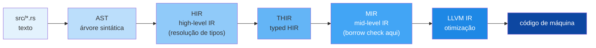

<a id="capitulo-59"></a>
# Capítulo 59: O Compilador por Dentro — MIR, LLVM, Borrowck

> *"A compiler is a translator. A great compiler is also a teacher."*
> — anônimo, atribuído ao Rust team

> *"Entender como rustc funciona é entender por que Rust é o que é."*

## 59.1 O Pipeline em Uma Página

Quando você roda `cargo build`, há mais coisas acontecendo do que tradução para código de máquina:



Cada etapa serve a um propósito. As escolhas de design dessas etapas explicam quase todas as características práticas de Rust — incluindo o tempo de compilação.

## 59.2 Da Source ao AST

A primeira etapa é trivial: tokenizar (lexar) e parsear o texto em uma árvore sintática abstrata (AST). Macros declarativas (`macro_rules!`) operam sobre tokens nesta fase. Macros procedurais recebem `TokenStream` e devolvem `TokenStream`.

Isso significa: macros não veem tipos, não veem nomes resolvidos. Veem só forma sintática. Por isso elas são tão poderosas e tão limitadas ao mesmo tempo.

## 59.3 HIR — A Linguagem Quase-Rust

HIR (High-level IR) é uma representação simplificada do AST. Aqui acontece:

- **Resolução de nomes**: `foo::bar` vira o item específico no grafo de módulos.
- **Desugaring**: `for x in v { ... }` vira `loop { match v.next() { ... } }`. `if let Some(x) = ... { ... }` vira `match`. Assim por diante.
- **Type inference**: Hindley-Milner local resolve variáveis sem anotação.
- **Trait resolution**: o método `.foo()` é mapeado ao `impl` específico (ou trait object).

HIR é onde *quase tudo* sobre tipos é decidido. Aqui acontece a maior parte do trabalho conceitual.

## 59.4 MIR — A Joia da Coroa

MIR (Mid-level IR) é uma das contribuições técnicas mais elogiadas de Rust. É uma representação **explícita do controle de fluxo** em forma de grafo de blocos básicos. Cada operação é elementar; nada é implícito.

Por que MIR foi inventado:

1. **Borrow checker antigo** operava sobre AST/HIR. Era lento, limitado, e gerava erros confusos.
2. **MIR é simples**: blocos básicos, statements explícitos, sem açúcar.
3. **Análise sobre MIR é tratável**: o compilador pode executar dataflow analysis com algoritmos clássicos.
4. **Transformações sobre MIR são triviais**: const eval, dead code elimination, drop insertion.

Borrow checking sobre MIR é o que viabilizou **NLL (Non-Lexical Lifetimes)** em 2018, que viabilizou idiomas que Rust nunca conseguia compilar antes.

## 59.5 Polonius — A Próxima Geração

A implementação atual de borrow check sobre MIR já é ótima, mas tem limitações reconhecidas. **Polonius** é a próxima geração:

- Reformula borrow check em termos de **regras Datalog** declarativas.
- Aceita programas que NLL ainda rejeita (problem case 3 famoso).
- Mais rápido em alguns casos, mais explícito em diagnósticos.

Polonius está em rollout (`-Zpolonius` em nightly). Estabilização prevista para os próximos anos. Quando chegar, várias soluções alambicadas com `match` para contornar o borrow checker se tornarão desnecessárias.

## 59.6 Trait Resolution — Chalk

A resolução de traits em Rust é não-trivial. Considere:

```rust
fn foo<T: Clone + Iterator>(t: T) where T::Item: Display { ... }
```

O compilador precisa provar que `T` implementa `Clone` E `Iterator`, e que `T::Item` implementa `Display`. Em casos com generics aninhados, a busca pode ser exponencial sem cuidado.

**Chalk** é um motor de resolução de traits baseado em Prolog/Datalog. Está sendo gradualmente integrado em rustc. Benefícios esperados:

- Resolução mais rápida e correta.
- Suporte para features avançadas (HKT-like patterns) que o algoritmo atual não consegue.
- Garante coerência entre rustc e rust-analyzer (que já usa chalk).

## 59.7 LLVM — O Backend de Fato

Após MIR, rustc traduz para LLVM IR. LLVM é o backend de otimização mais avançado em uso público — também usado por Clang (C/C++), Swift, Julia e outros.

O custo: LLVM é lento. As passes de otimização (inlining, DCE, GVN, vectorization) consomem a maior parte do tempo de compilação em release. Em debug, LLVM faz menos, e ainda assim é a parte mais lenta.

**Cranelift** é uma alternativa: backend mais rápido (10-50x), com otimizações mais simples. Usado por:
- Builds debug em desenvolvimento (experimental, mas em rollout).
- Wasmtime para JIT de WASM.
- Lucet, Spin, e outros runtimes WASM.

Esperado: builds debug com Cranelift por padrão em alguns anos.

## 59.8 Por Que Rust Compila Lento

Resumido:

1. **Monomorphization**: cada uso de `Vec<T>` com tipo concreto gera código separado. Generic-heavy crates explodem em quantidade de código.
2. **LTO e otimização agressiva**: por design, gerar código rápido é caro.
3. **Macros**: especialmente proc-macros, que executam código Rust em tempo de build.
4. **Crates dependentes muitas vezes**: `serde_derive` (usado por quase tudo) recompila para cada combinação de features.
5. **Type inference complexa**: Hindley-Milner com traits, lifetimes, GATs — solver pode ser lento.

Mitigações:
- `cargo check` faz tipo-check sem codegen (rápido).
- `incremental compilation` reaproveita trabalho.
- `mold`/`lld` aceleram linkagem.
- `--release` só quando necessário; debug builds para iteração.
- Modular: divida em workspaces para não rebuildar tudo.

## 59.9 Editions — Evolução Sem Quebrar

C++ tem comitê com release a cada 3 anos. Java tem releases anuais. Rust tem **editions** a cada 3 anos (2015, 2018, 2021, 2024) com regra simples: **toda crate declara sua edition, e crates de editions diferentes interoperam**.

Isso permite que Rust evolua sintaxe (palavras-chave novas, mudanças de semântica, deprecations) sem quebrar bilhões de linhas existentes. `cargo fix --edition` automatiza migração.

Exemplos do que mudou entre editions:
- 2018: módulos sem `mod.rs`, `?` operator estável, NLL.
- 2021: `IntoIterator for arrays`, disjoint capture em closures.
- 2024: `gen` blocks (gerador), `async fn` em traits estabilizado, `let-else`.

## 59.10 RFC Process

Toda mudança não-trivial em Rust passa por um **RFC (Request for Comments)**:

1. Desenhe o RFC em texto.
2. Submeta como PR ao [rust-lang/rfcs](https://github.com/rust-lang/rfcs).
3. Comunidade comenta. RFCs viram threads de centenas de mensagens.
4. Time relevante (lang, libs, compiler) vota.
5. Se aceito: implementação em nightly, atrás de feature flag.
6. Após uso e refinamento: estabilização.

O processo é deliberadamente lento. Features como `async fn in traits` levaram quase uma década do RFC inicial à estabilização. Isso é frustrante para quem quer features rápido — mas é por isso que Rust não tem `Object.prototype.__proto__.__proto__.__proto__` ou outros pesadelos históricos.

## 59.11 Como Inspecionar

```bash
# Ver MIR de uma função
cargo rustc -- --emit=mir
# ou
cargo rustc -- -Zunpretty=mir-cfg

# Ver LLVM IR
cargo rustc --release -- --emit=llvm-ir

# Ver assembly
cargo rustc --release -- --emit=asm
# ou usar cargo-asm

# Expandir macros
cargo expand
```

Ler MIR é instrutivo: você vê exatamente onde drops são inseridos, onde temporários vivem, onde o borrow checker raciocina.

## 59.12 Rust não é mágica

Cada decisão técnica — borrow checker em MIR, monomorphization, trait resolution via chalk, LLVM como backend — é tradeoff explícito. Rust é uma linguagem desenhada com clareza brutal sobre o que sacrifica para o que ganha.

Compreender o pipeline não é exigência para *usar* Rust. Mas é a diferença entre ser usuário e ser engenheiro. Quando algo dá errado — borrow check incompreensível, build de 20 minutos, generics que não inferem — saber que parte do pipeline está falhando é o que te tira do impasse.

---

> *"Toda boa linguagem é a memória de seus erros antigos. Em Rust, essa memória vive no compilador."*

[← Capítulo 58 — Rust no Kernel](ch58-rust-no-kernel.md) | [Próximo: Capítulo 60 — Cultura Rust →](../part-21-philosophy/ch60-cultura-rust.md)
