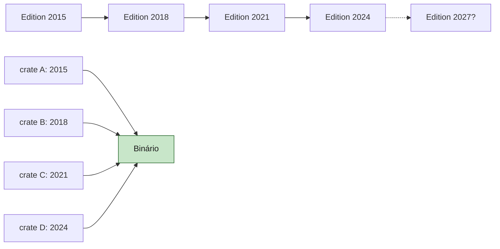

<a id="capitulo-60"></a>
# Capítulo 60: A Cultura Rust — RFC, Editions, Comunidade

> *"Linguagens não são especificações. São culturas com sintaxe."*
> — anônimo, em algum lugar do r/rust

> *"Stability without stagnation."*
> — slogan oficial do Rust Project

> *"A linguagem que você escreve hoje é o sedimento das pessoas que decidiram, ano após ano, recusar atalhos."*

## 60.1 A Pergunta que Todo Mundo Faz Errado

Quando alguém me pergunta *"por que Rust ganhou?"*, eu respondo com outra pergunta: **ganhou de quem?**

Porque se a pergunta é *"venceu C++ em performance?"*, a resposta é não — empata. Se é *"venceu Go em adoção?"*, é não — Go ainda tem mais usuários em backend. Se é *"venceu TypeScript em ergonomia?"*, é não — Rust é mais difícil.

Rust não venceu nenhuma dessas batalhas isoladas. Rust venceu uma guerra que ninguém percebeu que estava acontecendo: a guerra pela **forma como uma linguagem é construída**.

Esse capítulo é sobre essa guerra. Sobre o que torna a cultura Rust singular, e por que isso importa mais que qualquer feature da linguagem.

## 60.2 O RFC Como Forma de Civilização

Toda linguagem tem um processo de mudança. A pergunta é: esse processo é **público**?

Em C++, o processo é o Comitê ISO. Reuniões físicas, papers em PDF, votos por nação, ciclos de três anos. Para uma feature entrar, ela passa por subcomitês, vota em plenário, é incorporada ao standard, e três anos depois um compilador implementa. *Stable, mas geológico.*

Em Go, o processo é o time da Google. Discussão acontece em mailing lists e proposals no GitHub, mas a decisão final é de quatro ou cinco engenheiros do Google. Generics levaram dez anos para chegar — não porque a comunidade não queria, mas porque Rob Pike achava que não eram necessários.

Em TypeScript, o processo é o time da Microsoft. Issues são abertas no GitHub, discutidas, e Anders Hejlsberg ou Daniel Rosenwasser decidem. Funciona bem, mas é **benevolent dictatorship**, não democracia.

Em Rust, o processo é o **RFC (Request for Comments)**.

```
                  ┌─────────────────────────────────────┐
                  │ Toda mudança não-trivial em Rust    │
                  │ passa por RFC público no GitHub.    │
                  └─────────────────────────────────────┘
                                  │
                                  ▼
        Pré-RFC (Zulip/Internals Forum) — discussão informal
                                  │
                                  ▼
        Draft RFC submetido como PR no rust-lang/rfcs
                                  │
                                  ▼
        Discussão aberta — qualquer um comenta
                                  │
                                  ▼
        Sub-team review (lang/libs/compiler/etc)
                                  │
                                  ▼
        Final Comment Period (FCP) — 10 dias de aviso amplo
                                  │
                                  ▼
                ┌────────────────┴─────────────────┐
                ▼                                  ▼
            Merged                              Closed
                │
                ▼
        Tracking issue criado no rust-lang/rust
                │
                ▼
        Implementação (qualquer um pode pegar)
                │
                ▼
        Estabilização (após nightly + soak time)
```

A diferença não é sintática. É **antropológica**.

Quando você quer adicionar `let-else` em Rust, você não manda email para Mozilla. Você não pede permissão para a Foundation. Você abre um PR público, escreve a motivação, expõe alternativas consideradas, lista drawbacks, projeta unresolved questions, e a comunidade — incluindo o lang team — comenta linha por linha. Depois de meses (às vezes anos), entra em FCP. Se ninguém bloqueia com argumento técnico no FCP, está aceito.

Esse processo tem custos óbvios. É **lento**. É **político**. Bikeshedding sobre nomes de keywords toma semanas. Mas tem uma virtude que nenhuma alternativa tem: **a justificativa de toda decisão de design está escrita**, em prosa, em GitHub, para sempre.

```rust
// Por que o Rust escolheu `let else` em vez de `unless let`?
//
// Resposta longa: leia a RFC 3137.
// Resposta curta: porque oito pessoas em uma thread de 400 comentários
// argumentaram melhor que as outras dez.
```

Não é elegante. É *honesto*. E honestidade institucional é o ativo mais raro em software.

## 60.3 Editions: Stability Sem Stagnation

Em 1999, quando o C++98 saiu, o committee se comprometeu a manter compatibilidade com C++. Vinte e cinco anos depois, código C++98 ainda compila em compiladores modernos. Isso é uma virtude.

Mas é também uma prisão. Você não pode tirar `auto_ptr`. Não pode tornar `>>` parser-friendly em templates sem hack. Não pode mudar a precedência de operadores. A linguagem **acumula sedimento**.

Rust resolveu esse problema com **Editions**. A ideia é simples e brilhante:

> Cada crate declara em seu `Cargo.toml` qual edition usa. O compilador trata cada edition como um dialeto. Editions diferentes podem coexistir no mesmo binário.

```toml
[package]
name = "meu-projeto"
edition = "2024"
```

O resultado é que Rust pode **evoluir sem quebrar**:

```rust
// Edition 2015: async não é keyword
fn async() { }  // OK

// Edition 2018: async vira keyword reservada
async fn foo() { }  // OK
fn r#async() { }    // syntax escape para usar como identifier

// Edition 2021: closures fazem disjoint capture
let mut x = (1, 2);
let c = || x.0 += 1;  // captura só x.0, não x inteiro

// Edition 2024: temporários em if let têm escopo mais estrito
if let Some(v) = lock.lock().get() { /* ... */ }
// drop do MutexGuard acontece antes do else, não no fim do if
```

A timeline é curta mas significativa:

| Edition | Ano | Tema |
|---|---|---|
| **2015** | 2015 | A original. Rust 1.0. Bare-bones, mas estável. |
| **2018** | 2018 | Module system rework, `async/await`, `?` operator, NLL completo. |
| **2021** | 2021 | Disjoint capture em closures, `IntoIterator` para arrays, panic macros consistentes. |
| **2024** | 2024 | `async fn in traits` estabilizado, `let chains`, RPITIT, lifetime captures explícitos. |

Cada três anos, a linguagem **renova o pacto**. Mas o pacto antigo continua válido. Você pode escrever código novo em edition 2024 que depende de uma crate em edition 2015 sem conflito.

Isso não é um detalhe de implementação. É uma filosofia. A filosofia é: **estabilidade não é a ausência de mudança, é a previsibilidade da mudança.**



Compare com Python 2 → Python 3, que dividiu a comunidade por dez anos. Compare com Scala 2 → Scala 3, que está dividindo agora. Compare com Perl 5 → Perl 6, que matou Perl. Editions são a resposta de Rust ao problema mais antigo do design de linguagens: *como evoluir sem trair*.

## 60.4 Six-Week Release Cycle

Rust libera uma versão estável **a cada seis semanas**. Sem exceção. Sem feature creep. Sem "vamos esperar a próxima feature ficar pronta".

```
nightly        →     beta         →    stable
(canal de    6 semanas        6 semanas
desenvolvimento)
```

O que está merged no `master` no dia X vira nightly no dia X. Doze semanas depois, vira stable.

Esse modelo foi roubado do Chrome (que rouba do Firefox, que rouba do Linux). É contra-intuitivo: ciclos curtos parecem instáveis. Na prática, são o oposto.

**Por quê?** Porque ciclos longos acumulam pressão. Quando você tem dois anos entre releases, toda feature meia-pronta entra em pânico para "fazer o release". O resultado é o C++ pattern: o release sai com features quebradas que depois precisam ser corrigidas em ABI breaks.

Com seis semanas, ninguém entra em pânico. Se uma feature não está pronta, espera mais seis semanas. Não é o fim do mundo. A próxima janela é em mês e meio.

```rust
// Filosofia codificada no canal:
//
// nightly  = "experimente, mas não confie"
// beta     = "está congelado, achou bug? reporte"
// stable   = "esse é o contrato. não muda até o próximo stable."
```

E o contrato é levado a sério. Em quase 10 anos de Rust 1.0 (2015), houve **zero quebras de compatibilidade não-intencionais** em código safe. Quando o compilador descobre que aceitava algo que não deveria (soundness bug), há um processo formal de Future Compatibility Lint: o código é avisado por meses como warning antes de virar erro.

Isso é desconfortavelmente raro em nossa indústria.

## 60.5 Crates.io: Confiável o Suficiente

`crates.io` é o registry público do Rust. Registry, não package manager. Cargo é o manager. A distinção importa.

A filosofia de `crates.io` é diferente de `npm`:

- **Sem revogação**: uma vez publicado, um crate na versão X.Y.Z não pode ser apagado. Pode ser **yanked** (não aparece em novas resolutions), mas builds antigos que dependem dele continuam funcionando. Sem `left-pad incident`.
- **Sem squatting agressivo**: nomes são first-come-first-served, mas a equipe pode transferir nomes não-utilizados quando há disputa razoável.
- **Sem walled garden**: você pode hospedar seu próprio registry. Cargo suporta nativamente.

E tem `cargo audit`:

```bash
$ cargo audit
    Fetching advisory database from `https://github.com/RustSec/advisory-db.git`
      Loaded 521 security advisories
    Updating crates.io index
    Scanning Cargo.lock for vulnerabilities (245 crate dependencies)
Crate:         tokio
Version:       1.18.0
Title:         Data race in `Notify`
Date:          2023-01-30
ID:            RUSTSEC-2023-0001
Solution:      Upgrade to >=1.18.5
```

Não é perfeito. Há tipo-squatting. Há crates abandonados. Há a tentação eterna de transitive dependencies de mil crates para um Hello World — *Rust não é imune ao node_modules problem.* Mas a infraestrutura é levada a sério, é financiada pela Foundation, e é auditada continuamente.

Comparado com PyPI (que aceita pacotes maliciosos com regularidade), com npm (que tem problemas de account takeover crônicos), e com Maven Central (que requer GPG mas tem UX brutal), `crates.io` é o registry mais saudável em uso massivo hoje.

## 60.6 The Friendly Compiler

Toda linguagem tem mensagens de erro. Quase todas as linguagens **odeiam você** quando produzem essas mensagens.

C++:

```
error: no matching function for call to 'std::vector<int>::push_back(std::__cxx11::basic_string<char>)'
note: candidate: void std::vector<_Tp, _Alloc>::push_back(const value_type&) [with _Tp = int; _Alloc = std::allocator<int>; std::vector<_Tp, _Alloc>::value_type = int]
note:   no known conversion for argument 1 from 'std::__cxx11::basic_string<char>' to 'const value_type& {aka const int&}'
```

Java:

```
Exception in thread "main" java.lang.NullPointerException
    at com.example.Foo.bar(Foo.java:42)
```

Rust:

```
error[E0308]: mismatched types
  --> src/main.rs:3:18
   |
3  |     vec.push_back("hello");
   |         --------- ^^^^^^^ expected `i32`, found `&str`
   |         |
   |         arguments to this function are incorrect
   |
note: function defined here
help: convert the string to an integer
   |
3  |     vec.push_back("hello".parse().unwrap());
   |                          ++++++++++++++++++
```

A diferença não é técnica. É **moral**.

O compilador Rust é projetado por humanos que acreditam que **uma mensagem de erro é um momento pedagógico**. O usuário está confuso, vulnerável, frustrado. A resposta certa não é "você errou, eis a definição formal da regra que você violou". A resposta certa é: *"isso é o que você quis dizer. Aqui está o que está errado. Aqui está como talvez você queira corrigir."*

Esse compromisso tem nome: **rustc é o compilador amigável**. Há um time inteiro (`diagnostics`) que trabalha *só* em melhorar mensagens de erro. PRs são aceitos especificamente para "melhorar a experiência de quando o usuário escreve `=` em vez de `==`". Existem benchmarks de qualidade de mensagem.

Isso não é vaidade. É política de produto. É o reconhecimento de que **a interface humana de uma linguagem é a interface mais importante**.

```rust
fn main() {
    let v: Vec<i32> = vec![1, 2, 3];
    let r = &v[10];  // panic em runtime, não compile-time
}
```

Compile esse código. O compilador não pega — em runtime, dá panic. Mas o panic em si é estruturado:

```
thread 'main' panicked at 'index out of bounds: the len is 3 but the index is 10', src/main.rs:3:14
note: run with `RUST_BACKTRACE=1` environment variable to display a backtrace
```

Linha. Coluna. Mensagem clara. Sugestão de variável de ambiente para mais detalhes. Tudo isso é trabalho de design, não acidente.

## 60.7 docs.rs: Documentação Como Direito

`docs.rs` é o serviço que **automaticamente** gera documentação para todo crate publicado em `crates.io`. Sem configuração. Sem CI. Sem opt-in.

```rust
/// Adiciona dois números.
///
/// # Exemplos
///
/// ```
/// let resultado = my_crate::add(2, 2);
/// assert_eq!(resultado, 4);
/// ```
///
/// # Pânico
///
/// Esta função entra em pânico se `a + b` causar overflow em modo debug.
pub fn add(a: i32, b: i32) -> i32 {
    a + b
}
```

Você publica. Cinco minutos depois, há uma página em `docs.rs/my_crate/0.1.0/my_crate/fn.add.html` com:

- Assinatura formatada
- Markdown renderizado
- Exemplos *executados como testes* via `cargo test --doc`
- Links para todos os tipos referenciados, incluindo cross-crate
- Source code embutido com syntax highlighting

Isso é **infraestrutura cultural**. A consequência é que todo crate publicado em Rust tem documentação navegável e moderna. Compare com Python (Sphinx é opcional, instalação varia), com JavaScript (`tsdoc`, `jsdoc`, ou nada), com Go (godoc é bom mas estilizado para um padrão antigo).

A documentação em Rust é **um direito do usuário**, não um esforço do mantenedor. Essa pequena diferença muda toda a economia da contribuição open source.

## 60.8 Rust Foundation: Neutralidade Como Estratégia

Em 8 de fevereiro de 2021, foi anunciada a **Rust Foundation**.

Antes disso, Rust era *patrocinado* pela Mozilla. Os engenheiros principais eram funcionários Mozilla. A marca era da Mozilla. A infraestrutura rodava em servidores Mozilla.

Em 2020, Mozilla demitiu a maior parte do time de Rust. Foi um momento de pânico genuíno. *A linguagem ia morrer?*

A resposta foi a Foundation. Membros fundadores: AWS, Google, Huawei, Microsoft, Mozilla. Membros silver e platinum vieram depois: Meta, JetBrains, Embark, Toyota, Volvo, ARM. Ninguém controla. Todos pagam.

```
              ┌──────────────────────────────────┐
              │         Rust Foundation          │
              │     (legal, financial, infra)    │
              └────────────┬─────────────────────┘
                           │ funds
                           ▼
              ┌──────────────────────────────────┐
              │         Rust Project             │
              │ (technical decisions, by teams)  │
              └────┬─────┬─────┬─────┬─────┬────┘
                   │     │     │     │     │
                  Lang  Libs Compi Infra  Mod
                  Team  Team  Team  Team Team
                   │
                   └──> Decisões via RFC
```

A separação importa. **A Foundation paga as contas. O Project decide o que a linguagem é.** Quando AWS tem uma feature que quer ver na linguagem, AWS abre uma RFC como qualquer outro contribuidor. A RFC pode ser rejeitada. *Já foi rejeitada.*

Compare com Go (Google decide), TypeScript (Microsoft decide), Swift (Apple decide). Rust é a única linguagem mainstream onde **nenhuma corporação tem poder de veto técnico**.

Isso não é acidente. É design. E tem um custo: governança é mais lenta. Mas tem uma vantagem: nenhuma feature da linguagem é refém de prioridades de produto de uma empresa única. *Async fn in traits* não esperou nem foi acelerado por interesses de AWS — esperou pela maturidade técnica do design.

## 60.9 Code of Conduct e a Crise de 2021

Toda comunidade técnica eventualmente enfrenta a pergunta: **quem fica e quem sai?**

Rust enfrentou essa pergunta em novembro de 2021, quando o **Moderation Team inteiro renunciou em massa**. A renúncia foi pública, em um post no GitHub. A acusação: o Core Team estava acima das regras de conduta que o Mod Team era responsável por aplicar.

Foi uma crise existencial. A comunidade ficou dividida. Alguns viram o Mod Team como excessivamente puritano. Outros viram o Core Team como impune. Houve threads de mil comentários em Hacker News, Twitter, Reddit. Por semanas pareceu que a comunidade ia rachar.

O que aconteceu depois é importante:

1. O Core Team foi **dissolvido**. Não reformado, não renomeado — dissolvido.
2. Em seu lugar, foi criado o **Leadership Council**, com representação eleita de todos os times.
3. O Code of Conduct foi reformulado, com processo de moderação mais claro.
4. Um RFC formal de governança (RFC 3392) foi escrito, debatido e aprovado.

Não é que a comunidade seja perfeita. **Não é.** Há atrito, há rivalidades pessoais, há conflitos não-resolvidos. Mas o teste de uma instituição não é se há conflito — é como ela responde quando o conflito acontece.

Rust passou no teste. A linguagem não morreu. A comunidade não rachou. O processo se reformou em vez de se defender. Isso é raro. *É o que distingue cultura de marketing.*

> *"Open source não é sobre código aberto. É sobre processo aberto. E processo aberto inclui a moderação do processo aberto."*

## 60.10 r/rust, This Week in Rust, e a Polidez

Há um meme antigo: *"Rust developers are insufferably polite."*

É verdade. E é deliberado.

Quando você posta uma dúvida básica no `r/rust`, ninguém responde "rtfm". Quando você abre uma issue mal formulada no GitHub, ninguém te humilha. Quando você comete um erro evidente em um PR, o comentário é **gentil**.

Isso não é fingimento — é cultivo. A comunidade Rust deliberadamente importou normas de código de conduta, normas de mentoria, normas de mediação que outras comunidades técnicas (notavelmente Linux, BSD, e várias subculturas C++) historicamente rejeitaram.

O resultado é mensurável:

- **Stack Overflow Survey**: Rust é "most loved language" há 9 anos seguidos (2016-2024).
- **GitHub contributors**: a barra de entrada percebida é alta tecnicamente mas baixa socialmente.
- **This Week in Rust**: newsletter semanal, voluntária, contínua desde 2014, com curadoria comunitária.

A polidez não é cosmética. É infraestrutura. *Comunidades hostis perdem contribuidores marginais.* E contribuidores marginais — pessoas que não estão lá pra construir reputação, mas pra resolver um problema específico e seguir em frente — são a maior parte do trabalho de um projeto open source.

Rust entendeu isso antes da maioria. Por isso atraiu uma comunidade enorme com relativamente pouco drama público.

## 60.11 Comparação Cultural

Vamos colocar lado a lado:

| Dimensão | C++ | Go | TypeScript | Rust |
|---|---|---|---|---|
| **Governança** | Comitê ISO | Google | Microsoft | Foundation + Teams |
| **Processo de mudança** | Papers + voto nacional | Proposals (Google decide) | Issues (MS decide) | RFC público |
| **Velocidade de release** | 3 anos | 6 meses | ~3 meses | 6 semanas |
| **Compat backwards** | Rígida (ISO) | Strong (Go 1 promise) | Soft (deprecate, remove) | Editions |
| **Registry** | Vendor (Conan, vcpkg) | go.mod + proxy | npm (problemas) | crates.io |
| **Mensagens de erro** | Hostis | Curtas e secas | Boas | Excelentes |
| **Docs auto-geradas** | Doxygen (manual) | godoc | TypeDoc (opcional) | docs.rs (auto) |
| **CoC público** | Não | Sim, fraco | Sim, fraco | Sim, central |
| **Foundation neutra** | ISO (consórcio) | Não (Google) | Não (MS) | **Sim** |

Toda linguagem fez escolhas. Cada escolha é defensável. Mas **o conjunto** das escolhas de Rust é único: é a única linguagem mainstream onde o processo de mudança é público, a Foundation é neutra, a release cadence é frequente, e a comunidade é deliberadamente cultivada.

## 60.12 O Que Cultura Não Pode Salvar

Cultura não compensa todos os problemas. Rust ainda tem:

- **Curva de aprendizado** alta. Borrow checker é difícil. Lifetimes são confusas.
- **Compile times** lentos. Builds incrementais melhoraram, mas builds limpos ainda são longos.
- **Ecossistema async fragmentado** entre Tokio, async-std (defunct), smol. Falta consenso.
- **GUI** ainda imatura. Slint, Tauri, egui, Iced — promissores, nenhum dominante.
- **ML/AI ecosystem** nascente. Candle e Burn existem, mas Python continua dominando.

Cultura não resolve isso. Cultura cria as condições para resolver isso ao longo de anos. E é por isso que importa: porque uma linguagem com cultura saudável **converge** ao longo do tempo, enquanto linguagens sem cultura **divergem** ao longo do tempo.

C++ tem trinta anos de cultura sedimentar e está fragmentado em dialetos (Google C++, LLVM C++, Qt C++, embedded C++). Cada empresa grande inventou o seu Modern C++.

Rust tem dez anos. E ainda há **um Rust**. Um idiom. Um clippy. Um rustfmt. Um cargo. Uma docs.rs. Não é coincidência. É o resultado de um processo cultural deliberado.

## 60.13 O Que Levo Daqui

Eu programo profissionalmente desde 2015. Vi Java se tornar legacy. Vi Ruby explodir e implodir. Vi Go ganhar mainstream. Vi TypeScript redefinir o front-end. Vi Python se tornar a língua franca de ciência de dados.

Em todas essas linguagens, eu aprendi o **idioma**. Em Rust, eu aprendi o **idioma e a cultura**. E acho que a cultura é a parte mais transferível.

```rust
// Lições que eu levo de Rust para qualquer linguagem:
//
// 1. Erros bem formulados são uma feature, não polish.
// 2. Documentação automatizada é infraestrutura, não bônus.
// 3. Compatibilidade backwards é um pacto moral.
// 4. Governança neutra é mais valiosa que velocidade de decisão.
// 5. Comunidades polidas atraem contribuidores marginais.
// 6. RFCs públicos preservam a memória institucional.
// 7. Editions são a forma certa de evoluir sem trair.
```

Se Rust desaparecer amanhã (não vai), essas lições sobrevivem. Elas vão estar em alguma linguagem que ainda não foi inventada, que vai ser construída por alguém que aprendeu observando Rust fazer certo.

E talvez seja essa a maior contribuição que uma linguagem pode dar: **provar que era possível**.

---

> *"Linguagens morrem. Culturas mudam de meio."*

[Próximo: Capítulo 61 — Anti-Patterns em Rust →](ch61-anti-patterns.md)
