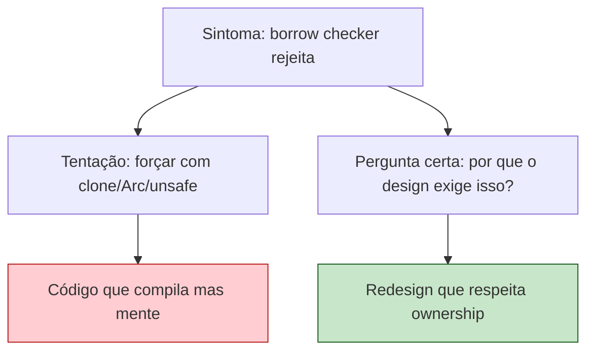
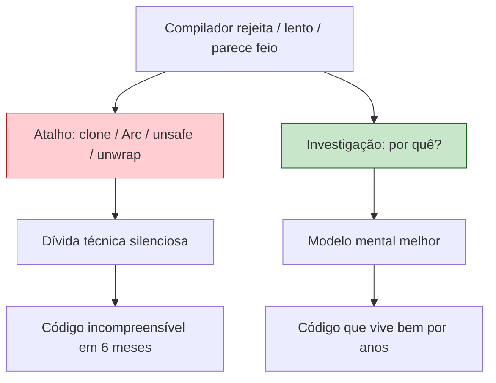

<a id="capitulo-61"></a>
# Capítulo 61: Anti-Patterns em Rust

> *"You can write FORTRAN in any language."*
> — anônimo, mas todo programador sênior já disse isso

> *"O borrow checker não é seu inimigo. Ele é a sua consciência. Se está te recusando, ouça."*

> *"Rust não é difícil. Rust é honesto sobre o que código de sistemas precisa. A maioria das linguagens minte por gentileza."*

## 61.1 Por Que Anti-Patterns Importam

Esse capítulo é o oposto do anterior. O anterior celebrou. Este vai cutucar.

Anti-patterns em Rust não são bugs. **São hábitos importados de outras linguagens que tecnicamente compilam, mas traem o design de Rust.** Compilam, rodam, passam em testes — e ainda assim estão errados, no sentido de que ignoram tudo o que Rust está tentando te ensinar.

Eu aprendi cada um desses anti-patterns *cometendo-os*. Esse capítulo é uma carta para o meu eu de seis meses atrás, e talvez para você se está agora no momento em que tudo parece confuso e a saída fácil parece tentadora.

A regra geral é: **se você está lutando muito com o borrow checker, geralmente o problema não é o borrow checker. O problema é que você está descrevendo um design que tem um problema, e o compilador está te avisando.**



Vamos aos dez.

## 61.2 Anti-Pattern #1: Arc<Mutex<T>> Como Default

O sintoma é claro. Você vem de Java/Go, está escrevendo Rust pela primeira vez, e tudo que é compartilhado entre threads ou módulos vira `Arc<Mutex<T>>`.

```rust
// O que recém-chegado escreve
use std::sync::{Arc, Mutex};

struct Servico {
    cache: Arc<Mutex<HashMap<String, String>>>,
    config: Arc<Mutex<Config>>,
    metrics: Arc<Mutex<Metrics>>,
    db: Arc<Mutex<Database>>,
}
```

Isso compila. Roda. E é quase sempre **errado**.

`Arc<Mutex<T>>` significa: "esse dado é compartilhado entre múltiplos donos *e* mutável de qualquer um deles". É o modelo mental de Java. Em Rust, é a opção mais cara e mais frágil.

Por que está errado:

1. **Lock contention**: cada acesso é serializado. Threads bloqueiam threads.
2. **Deadlock**: dois locks adquiridos em ordens diferentes em threads diferentes = bug em produção.
3. **Cancela todo o ganho de performance** que Rust te dava.
4. **Esconde o design**: você não pensou sobre quem deveria ser dono.

A pergunta certa é: *quem realmente é dono desse dado?*

```rust
// Refatoração 1: Config é imutável depois de carregado
struct Servico {
    config: Arc<Config>,  // sem Mutex, é só read
    cache: Arc<Mutex<HashMap<String, String>>>,
    metrics: Arc<AtomicMetrics>,  // tipos atomic eliminam Mutex
    db: DatabasePool,  // pool já é internamente sincronizado
}

// Refatoração 2: actor pattern
struct Servico {
    cache_tx: mpsc::Sender<CacheCommand>,  // mensagens, não compartilhamento
    // o cache vive em uma task dedicada
}

// Refatoração 3: ownership exclusivo
fn processar(req: Request, mut cache: HashMap<String, String>) -> (Response, HashMap<String, String>) {
    // cache passa exclusivamente, sem lock
}
```

Cada uma é mais idiomática que a primeira. A regra geral é: **`Arc<Mutex<T>>` é a opção de último recurso, não a primeira.** Se você está usando, justifique para si mesmo: por que não `Arc<RwLock<T>>` (mais leitura)? Por que não `mpsc` (passar por mensagens)? Por que não `Atomic*` (tipos primitivos)? Por que não simplesmente possuir o dado em uma só task?

## 61.3 Anti-Pattern #2: .clone() Como Aspirina

O segundo anti-pattern mais comum é abusar de `.clone()` para fazer o borrow checker calar a boca.

```rust
// O que se escreve quando se está cansado
fn processar(usuarios: &Vec<Usuario>) {
    for usuario in usuarios.clone() {  // clonou tudo!
        let nome = usuario.nome.clone();  // cloned again
        let email = usuario.email.clone();  // outra vez
        salvar(nome, email);
    }
}
```

Cada `.clone()` é uma alocação. Em hot paths, isso destrói performance. Mas o problema maior nem é performance — é que **`.clone()` esconde o problema de design**.

Quando você cloneia para resolver erro de borrow checker, você está dizendo: "eu não consegui pensar em quem deveria possuir esse dado, então vou fazer cópias eternas". O design do programa fica confuso. Em três meses, ninguém entende mais o fluxo de dados.

A reescrita honesta:

```rust
// Reescrita: pegar emprestado, não clonar
fn processar(usuarios: &[Usuario]) {
    for usuario in usuarios {
        salvar(&usuario.nome, &usuario.email);  // empresta
    }
}

fn salvar(nome: &str, email: &str) {  // funções aceitam slices
    // ...
}
```

Quando `.clone()` é legítimo:

- Ao cruzar boundaries de threads (onde ownership precisa ser duplicada).
- Quando a estrutura é pequena (`Copy` types não chamam clone, mas tipos pequenos como `String` curtas são baratos).
- Quando estamos prototipando e otimização será posterior — *com TODO explícito.*

```rust
// TODO: avaliar se esse clone é necessário após a feature ficar pronta
let copia = dados.clone();
```

Sem o TODO, o `.clone()` se transforma em dívida silenciosa. Com o TODO, é uma promessa.

## 61.4 Anti-Pattern #3: Hierarquia OOP via trait objects

Vindo de Java/C#, é tentador construir hierarquias profundas:

```rust
// Tradução literal de Java em Rust — não faça isso
trait Animal {
    fn fazer_som(&self) -> String;
    fn comer(&mut self);
}

trait Mamifero: Animal { /* ... */ }
trait Cao: Mamifero {
    fn balancar_rabo(&self);
}

struct Labrador { /* ... */ }
impl Animal for Labrador { /* ... */ }
impl Mamifero for Labrador { /* ... */ }
impl Cao for Labrador { /* ... */ }

fn passear(caes: Vec<Box<dyn Cao>>) {
    // dynamic dispatch everywhere
}
```

Esse código é "polimórfico" em sentido OO clássico. Mas Rust não foi projetado para isso. Em Rust, o caminho idiomático é **composição via traits pequenas**.

```rust
// Idiomático em Rust: traits pequenos, compostos
trait FazerSom {
    fn som(&self) -> &str;
}

trait Comer {
    fn comer(&mut self, alimento: Alimento);
}

trait BalancarRabo {
    fn balancar(&self);
}

struct Labrador {
    nome: String,
    energia: u32,
}

impl FazerSom for Labrador {
    fn som(&self) -> &str { "woof" }
}

impl Comer for Labrador {
    fn comer(&mut self, alimento: Alimento) {
        self.energia += alimento.calorias();
    }
}

// Funções aceitam o que precisam, não toda a hierarquia
fn passear<C: BalancarRabo + FazerSom>(cao: &C) {
    println!("{}", cao.som());
    cao.balancar();
}
```

A diferença mental: em Java, `Cao IS-A Mamifero`. Em Rust, **um Labrador faz isso e aquilo**. Pequenas traits compostas. Generics quando estática serve, trait objects quando precisamos heterogeneidade dinâmica genuína.

```rust
// Trait objects válidos: heterogeneidade real
let pets: Vec<Box<dyn FazerSom>> = vec![
    Box::new(Labrador { /* ... */ }),
    Box::new(Gato { /* ... */ }),
    Box::new(Papagaio { /* ... */ }),
];

for pet in &pets {
    println!("{}", pet.som());
}
```

A heurística: **se você está usando `Box<dyn Trait>` porque "todo OO usa polimorfismo dinâmico", está errado. Se está usando porque os tipos são genuinamente heterogêneos em runtime, está certo.**

## 61.5 Anti-Pattern #4: unwrap() em Produção

`.unwrap()` é uma das primeiras coisas que se aprende em Rust. E é uma das primeiras coisas que viram hábito tóxico.

```rust
// O que se escreve no terceiro dia de Rust
let arquivo = File::open("config.json").unwrap();
let config: Config = serde_json::from_reader(arquivo).unwrap();
let porta = config.porta.unwrap();
let server = TcpListener::bind(format!("0.0.0.0:{}", porta)).unwrap();
```

Cada `.unwrap()` é uma promessa. *"Eu, programador, juro que esse Result/Option nunca será Err/None em runtime."*

Quando essa promessa quebra, o programa morre com um panic. Sem contexto. Sem stack trace útil. Em produção. Às 3h da manhã.

A diferença entre prototipo e produção é como você trata os `Result`:

```rust
// Em produção: contexto explícito em todo erro
use anyhow::{Context, Result};

fn carregar_config() -> Result<Config> {
    let arquivo = File::open("config.json")
        .context("falha ao abrir config.json — arquivo existe?")?;

    let config: Config = serde_json::from_reader(arquivo)
        .context("config.json mal-formado")?;

    let porta = config.porta
        .ok_or_else(|| anyhow!("config.porta ausente"))?;

    Ok(config)
}
```

Quando `.unwrap()` é aceitável:

- **Testes**: o panic é a falha do teste. Útil.
- **Prototipos descartáveis**: scripts de uma hora.
- **Casos provadamente impossíveis**: quando você acabou de checar.

```rust
// Caso provadamente impossível
let v = vec![1, 2, 3];
if !v.is_empty() {
    let primeiro = v.first().unwrap();  // OK: acabei de checar
}

// Mais idiomático ainda: estruturar para evitar unwrap
if let Some(primeiro) = v.first() {
    // ...
}
```

A heurística: **se o seu commit em produção tem `.unwrap()`, justifique no commit message ou refatore.**

## 61.6 Anti-Pattern #5: dyn Trait Quando Generic Serve

Continuação natural do anti-pattern #3.

```rust
// O que parece "flexível" e é desnecessariamente lento
fn processar(handlers: Vec<Box<dyn Handler>>) {
    for h in handlers {
        h.handle();
    }
}

struct Servico {
    storage: Box<dyn Storage>,  // dynamic dispatch em todo método
}
```

Cada chamada via `Box<dyn Trait>` é uma chamada virtual: lookup na vtable, indireção, sem inlining, sem otimizações cruzando a fronteira. Para hot paths, é caro. Para libs, mata zero-cost abstractions.

Quando você tem um único tipo concreto (ou poucos, conhecidos em compile time), use generics:

```rust
// Static dispatch: monomorfização, inlining, zero-cost
fn processar<H: Handler>(handlers: Vec<H>) {
    for h in handlers {
        h.handle();
    }
}

struct Servico<S: Storage> {
    storage: S,
}
```

Quando `dyn Trait` é correto:

- Plugin systems com tipos descobertos em runtime.
- Heterogeneidade genuína: lista de handlers de **tipos diferentes** registrados dinamicamente.
- Bounded code size: monomorfização tem custo de binário.
- API public boundary onde a flexibilidade vale o custo.

```rust
// dyn legítimo: heterogeneidade verdadeira
struct EventBus {
    listeners: Vec<Box<dyn Listener>>,  // listeners de tipos diferentes
}
```

A heurística: **comece com generics. Se um dia precisar de heterogeneidade real, aí sim use `dyn`. Não o contrário.**

## 61.7 Anti-Pattern #6: Self-Referential Structs

Em algum momento, você vai querer escrever isso:

```rust
// O que parece intuitivo e o compilador odeia
struct Documento {
    texto: String,
    palavras: Vec<&str>,  // referências para slices de `texto`
}
```

O borrow checker recusa. *Por quê?* Porque se `Documento` é movido (em um `Vec`, num return, num heap), as `&str` em `palavras` apontam para o lugar antigo. Use-after-free clássico.

A reação ingênua é tentar `Pin`, ouroboros, self_cell, e outros hacks. Funciona, mas o código fica ilegível.

A reação madura é redesenhar:

```rust
// Refactor 1: índices em vez de referências
struct Documento {
    texto: String,
    palavras: Vec<Range<usize>>,  // (start, end) em texto
}

impl Documento {
    fn palavra(&self, i: usize) -> &str {
        let r = &self.palavras[i];
        &self.texto[r.start..r.end]
    }
}

// Refactor 2: handles/IDs
struct DocId(u32);
struct Banco {
    docs: HashMap<DocId, String>,
    palavras: HashMap<DocId, Vec<Range<usize>>>,
}
```

A heurística: **quando você quer self-referential, geralmente quer dizer "tem uma estrutura indireta com índices, e eu não percebi". Use índices.**

## 61.8 Anti-Pattern #7: async em Todo Lugar

O ecossistema Rust async está maduro. Tokio, hyper, axum, sqlx — tudo é async first. E é tentador fazer todo o código async porque "é assim que se faz hoje".

```rust
// O que se escreve quando "tudo é async"
async fn calcular_hash(dados: &[u8]) -> u64 {
    let mut hasher = DefaultHasher::new();
    hasher.write(dados);
    hasher.finish()
}

async fn somar(a: i32, b: i32) -> i32 {
    a + b
}
```

Essas funções não fazem IO. Não há razão para serem async. O `async` adiciona overhead de state machine, força o caller a estar em runtime async, e polui a assinatura sem benefício.

A heurística: **async é para esperar IO. Para CPU, é overhead.**

```rust
// Síncrono onde síncrono basta
fn calcular_hash(dados: &[u8]) -> u64 {
    let mut hasher = DefaultHasher::new();
    hasher.write(dados);
    hasher.finish()
}

// Async apenas onde realmente espera IO
async fn buscar_usuario(db: &Pool, id: i64) -> Result<Usuario> {
    sqlx::query_as!("SELECT ... WHERE id = $1", id)
        .fetch_one(db)
        .await
}
```

Caso especial: CPU-bound dentro de async. Use `spawn_blocking`:

```rust
async fn processar_imagem(bytes: Vec<u8>) -> Result<Vec<u8>> {
    tokio::task::spawn_blocking(move || {
        // Processamento pesado, não bloqueia o reator async
        codificar_jpeg(&bytes)
    })
    .await?
}
```

A regra real: **async é uma cor, não uma feature.** Funções async só podem ser chamadas por funções async. Esse "color problem" é o custo de async. Cobre essa custo apenas onde traz benefício real (IO concorrente).

## 61.9 Anti-Pattern #8: Reinventar Runtime Async

Você vai ler sobre Tokio, achar que é "muito grande", e ter a tentação de escrever seu próprio executor.

```rust
// O que se escreve com 6 meses de Rust e zero senso de medida
struct MeuExecutor {
    queue: VecDeque<Task>,
}

impl MeuExecutor {
    fn run(&mut self) {
        while let Some(task) = self.queue.pop_front() {
            // ...complicado...
        }
    }
}
```

**Não faça isso.** Tokio existe há quase uma década, tem dezenas de mantenedores, foi auditado, é otimizado para casos do mundo real, suporta epoll/kqueue/IOCP, tem runtime para multi-thread e single-thread, e integra com `hyper`, `tonic`, `reqwest`, `sqlx`, e o resto do mundo.

Async runtime é como TLS: você pode escrever o seu, mas você vai errar de formas que não consegue prever, e o custo do erro é alto.

```rust
// Use Tokio. Sem desculpas.
#[tokio::main]
async fn main() {
    // ...
}

// Para casos minimalistas, smol é suficiente:
#[async_executor::main]  // ou pollster::block_on
async fn main() {
    // ...
}
```

A heurística: **se a sua intuição diz "vou escrever um executor pequeno", a realidade vai dizer "você passou três meses debugando race conditions que Tokio resolveu há cinco anos".** Não escale a aprendizagem em camadas. Comece de cima.

## 61.10 Anti-Pattern #9: Otimização Prematura

Rust é rápido. Mas isso não significa que **seu código** é rápido. E é tentador, sabendo da fama, otimizar antes de medir.

```rust
// Otimização prematura: SmallVec porque "pode ser mais rápido"
use smallvec::SmallVec;

fn juntar(a: &str, b: &str) -> SmallVec<[u8; 32]> {  // overengineered
    let mut v = SmallVec::new();
    v.extend_from_slice(a.as_bytes());
    v.extend_from_slice(b.as_bytes());
    v
}

// Otimização prematura: unsafe para "evitar bounds check"
unsafe fn somar(v: &[i32]) -> i32 {
    let mut total = 0;
    for i in 0..v.len() {
        total += *v.get_unchecked(i);  // por que?
    }
    total
}
```

Em ambos casos, o código idiomático é **igualmente rápido** ou mais rápido (porque o compilador entende melhor):

```rust
// Idiomático: vec, sem unsafe
fn juntar(a: &str, b: &str) -> Vec<u8> {
    let mut v = Vec::with_capacity(a.len() + b.len());
    v.extend_from_slice(a.as_bytes());
    v.extend_from_slice(b.as_bytes());
    v
}

// Idiomático: iterator, sem unsafe
fn somar(v: &[i32]) -> i32 {
    v.iter().sum()  // LLVM autovectorize
}
```

A regra: **profile primeiro, otimize depois.**

```bash
# Release build sempre
cargo build --release

# Profile de verdade
cargo install flamegraph
cargo flamegraph --bin meu-app

# Benchmarks são experimentos, não palpites
cargo install criterion
cargo bench
```

Benchmarks com `criterion` em vez de `Instant::now()` ad-hoc. Flamegraphs em vez de "sinto que está lento". Profile build em vez de debug build (releases são frequentemente 10-100x mais rápidos).

A heurística: **a otimização que importa é frequentemente arquitetural — algoritmo errado, alocação por chamada, copies em hot path. Micro-otimizações (SmallVec, unsafe, branch hints) são quase sempre prematuras até comprovadas.**

## 61.11 Anti-Pattern #10: Não Usar clippy

```bash
$ cargo clippy
```

`clippy` é o linter oficial de Rust. Tem mais de 700 lints. É **gratuito**. Roda em CI. Encontra bugs reais.

E ainda assim, o anti-pattern mais comum em projetos Rust de iniciantes é **não rodar clippy regularmente**.

```rust
// Código que clippy detecta
fn exemplo(v: Vec<i32>) -> i32 {
    let mut soma = 0;
    for i in 0..v.len() {  // clippy::needless_range_loop
        soma += v[i];
    }
    soma
}

// Sugestão automática do clippy
fn exemplo(v: Vec<i32>) -> i32 {
    v.iter().sum()
}
```

Lints que clippy pega rotineiramente:

- `needless_clone`: clone redundante.
- `redundant_closure`: `|x| f(x)` em vez de `f`.
- `unnecessary_unwrap`: padrão `if let Some(x) = ... { x.unwrap() }` redundante.
- `or_fun_call`: `unwrap_or(expensive_call())` em vez de `unwrap_or_else(|| expensive_call())`.
- `large_enum_variant`: enum com variant gigante (alocação ruim).
- `mutex_atomic`: `Mutex<bool>` quando `AtomicBool` serve.

Cada um desses é experiência de mantenedor sênior cristalizada em código. Você ganha décadas de revisão de código de graça.

```toml
# Cargo.toml: trate warnings como erros em CI
[lints.clippy]
all = "warn"
pedantic = "warn"
nursery = "warn"

# Em release, falhe build
[profile.release]
# ...
```

```bash
# CI script
cargo clippy --all-targets --all-features -- -D warnings
```

A heurística: **escutar clippy é aprender Rust pela boca de quem o construiu.** Quem ignora clippy paga caro depois — em bug em produção, em PR rejeitado, em refactor doloroso seis meses depois.

## 61.12 O Padrão Atrás dos Padrões

Reler os dez:

1. `Arc<Mutex<T>>` — não pensei sobre ownership.
2. `.clone()` aspirina — não pensei sobre fluxo de dados.
3. Hierarquia OOP — importei modelo errado.
4. `unwrap()` em prod — não pensei sobre falhas.
5. `dyn Trait` quando generic serve — escolhi flexibilidade que não preciso.
6. Self-referential structs — não pensei em índices.
7. `async` em todo lugar — confundi tendência com necessidade.
8. Reinventar runtime — subestimei complexidade do existente.
9. Otimização prematura — palpitei em vez de medir.
10. Não usar clippy — recusei mentoria gratuita.

Há um padrão. Cada anti-pattern é uma **forma de não pensar**. De pegar o caminho mais curto cognitivo. De ouvir o sintoma e tratar em vez de investigar a causa.



Rust te força a pensar mais cedo do que outras linguagens. Outras linguagens deixam você adiar. Mas o tempo total de pensar é igual — Rust só cobra na hora certa, em compile time, em vez de em produção em uma quinta-feira às 16h.

## 61.13 Quando Quebrar As Regras

Tudo que está acima é heurística. Não dogma.

Há código onde `Arc<Mutex<T>>` é a opção certa. Há código onde `.unwrap()` é correto. Há código onde escrever um pequeno executor faz sentido (tinyvec, embedded, didático).

A regra é: **quebre a regra com intenção, não com pressa.**

```rust
// Errado: cloned porque parou de tentar
fn processar(dados: Vec<u8>) -> Vec<u8> {
    let copia = dados.clone();  // por que?
    transformar(copia)
}

// Certo: cloned com justificativa
fn processar(dados: Arc<Vec<u8>>) -> Vec<u8> {
    // Precisamos modificar localmente, mas o original é compartilhado entre threads.
    // Clone aqui é deliberado.
    let mut local = (*dados).clone();
    transformar_inplace(&mut local);
    local
}
```

A diferença entre código profissional e código amador não é zero anti-patterns. **É anti-patterns conscientes.**

---

> *"O borrow checker é o melhor mentor que você nunca contratou. Ele não te paga elogios. Mas a cada PR ele te ensina a programar melhor."*

[Próximo: Capítulo 62 — O Futuro: Rust 2024 e Além →](ch62-futuro-rust.md)
