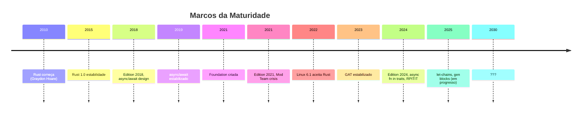
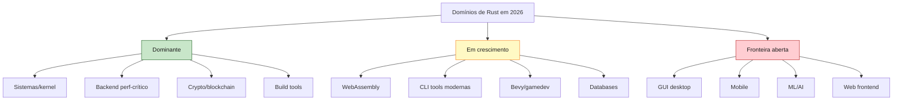
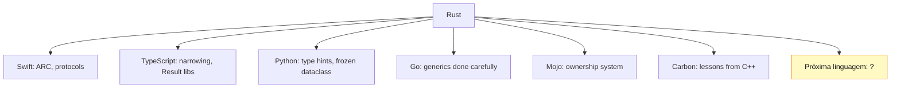

<a id="capitulo-62"></a>
# Capítulo 62: O Futuro — Rust 2024 e Além

> *"The future is already here — it's just not evenly distributed."*
> — William Gibson

> *"A próxima linguagem que vai ser melhor que Rust já está sendo escrita por alguém que aprendeu suas lições."*

> *"As linguagens que duram são as que ensinam. As que ensinam viram fundações para as próximas."*

## 62.1 Onde Estamos

É 2026. Rust 1.0 saiu em 2015. Onze anos depois, a linguagem:

- Está no kernel do Linux desde 6.1 (2022).
- Tem peças do kernel do Windows reescritas (DirectWrite, parts of NT).
- É linguagem aprovada no Android desde 2021.
- Roda Lambda inteiro (Firecracker), CDN inteira (Cloudflare Pingora), Discord (Read States), Dropbox (filesystem layer), e milhares de produtos menores.
- Foi a "linguagem mais amada" do Stack Overflow Survey por nove anos consecutivos.
- Tem mais de 150 mil crates publicados.

Esse não é mais o futuro. Esse é o presente. A pergunta deste capítulo é: **e o que vem depois?**



## 62.2 Edition 2024: O Que Mudou

Edition 2024 não foi revolução. Foi **consolidação**. As features que estavam em nightly por anos finalmente cruzaram a linha:

```rust
// 1. async fn in traits (AFIT) — finalmente nativo
trait Database {
    async fn buscar(&self, id: i64) -> Result<Usuario>;  // estabilizado!
    // antes: precisava async-trait crate ou Pin<Box<dyn Future>>
}

// 2. RPITIT — return position impl trait in trait
trait Servico {
    fn processar(&self) -> impl Iterator<Item = Item>;  // não-Boxed!
}

// 3. let-chains — múltiplos let dentro de if
if let Some(user) = autenticar()
    && let Ok(perms) = carregar_perms(&user)
    && perms.contains("admin")
{
    // ...
}

// 4. let-else — bind ou diverge
let Some(config) = carregar_config() else {
    return Err("config missing".into());
};

// 5. lifetime captures explícitos no impl Trait
fn iter<'a>(s: &'a [u8]) -> impl Iterator<Item = u8> + use<'a> {
    s.iter().copied()
}

// 6. unsafe attributes mais explícitas
#[unsafe(no_mangle)]
extern "C" fn callback() { /* ... */ }
```

Cada uma dessas pequenas mudanças é o **fim** de uma RFC que durou anos. Cada uma resolve um pequeno mas persistente atrito.

`async fn in traits` é talvez a mais importante. Por anos, escrever uma trait async em Rust exigia o crate `async-trait`, que internamente fazia `Pin<Box<dyn Future>>`. Custo de alocação por chamada. Boxing forçado. A nova versão é zero-cost.

```rust
// Antes (dependendo de async-trait macro)
#[async_trait]
trait Repo {
    async fn get(&self, id: i64) -> Result<User>;
    // gera: fn get(...) -> Pin<Box<dyn Future<Output=...> + Send + 'async_trait>>
}

// Edition 2024
trait Repo {
    async fn get(&self, id: i64) -> Result<User>;
    // gera: fn get(...) -> impl Future<Output=...>
    // sem Box, sem alocação, dispatch estático possível
}
```

Esse é o tipo de feature que **demora dez anos para chegar** porque exige resolver problemas profundos de design (como interage com `dyn Trait`? como inferir Send/Sync? como expressar lifetimes?). Mas, uma vez resolvida, redefine o ecossistema inteiro.

## 62.3 GATs: A Generalização Já Aqui

GATs (Generic Associated Types) foram estabilizados em 2023. Antes, o que parecia um detalhe técnico — *associated types podem ter parâmetros?* — viravam um teto baixo em todo design de trait avançado.

```rust
// Antes de GAT, isso era impossível
trait Iterator {
    type Item;
    fn next(&mut self) -> Option<Self::Item>;
}

// Mas e se Item depende de um lifetime do Self?
trait LendingIterator {
    type Item<'a> where Self: 'a;  // ← isso é GAT
    fn next(&mut self) -> Option<Self::Item<'_>>;
}
```

Soa abstrato? É. Mas habilita coisas como:

- **Streaming iterators**: iteradores que devolvem referências para o próprio buffer interno (impossível antes).
- **Async iteration genuíno**: traits async com `Item` que carrega lifetime.
- **Higher-kinded traits**: pseudo-HKT que functional programming languages têm gratuitamente.

GATs foram debatidos por **sete anos**. A RFC original é de 2016. A estabilização final é de 2023. Esse é o ritmo de Rust: features importantes são cozidas longamente.

## 62.4 O Que Está em Andamento

Várias features estão em nightly ou em RFC ativo. Algumas vão entrar nos próximos dois ou três anos:

### `gen blocks` — generators

```rust
// Em nightly
fn fibonacci() -> impl Iterator<Item = u64> {
    gen {
        let (mut a, mut b) = (0u64, 1u64);
        loop {
            yield a;
            (a, b) = (b, a + b);
        }
    }
}
```

Isso é **enorme**. Hoje, escrever um iterator complexo em Rust exige uma struct + state machine manual. Generators (com sintaxe `gen` e `yield`) deixam o compilador gerar a state machine automaticamente, como já faz para `async`.

### `try` blocks

```rust
// Em nightly: try-blocks
let resultado: Result<_, MyError> = try {
    let a = passo1()?;
    let b = passo2(a)?;
    let c = passo3(b)?;
    c
};

// Hoje precisamos de uma IIFE: || -> Result<_,_> { ... }()
```

### Specialization

A possibilidade de prover implementação default mais geral, com overrides específicos. Há quase 10 anos em discussão por questões de soundness com lifetime. Ainda não estabilizado, parcialmente disponível em `min_specialization`.

```rust
// O sonho
trait MyTrait {
    fn metodo(&self) -> String { "default".into() }
}

impl<T> MyTrait for T { /* default genérico */ }
impl MyTrait for String { fn metodo(&self) -> String { self.clone() } }
```

### `never` type (`!`)

Ainda não totalmente estabilizado. Permite expressar que uma função nunca retorna:

```rust
fn loop_forever() -> ! {
    loop { }
}

fn diverge() -> i32 {
    let x: ! = panic!("boom");  // ! pode coagir para qualquer tipo
    // unreachable, mas compila
}
```

### Linear types (research)

Tipos que **devem** ser consumidos (não apenas podem). Em Rust hoje, ownership permite `drop` automático no fim do escopo. Linear types eliminariam isso, forçando consumo explícito. É pesquisa ativa.

```rust
// Sintaxe hipotética (research)
linear struct Connection { /* ... */ }

fn handle(c: Connection) {
    // erro: c não foi consumido (drop é proibido em linear)
}

fn handle_ok(c: Connection) {
    c.close()  // consumo explícito
}
```

### Move-by-default e perfect derive

Rust hoje tem regras complexas sobre quando `derive(Clone)` se aplica a generics (`T: Clone`). Há trabalho em **perfect derive**: o compilador deduz os bounds exatos automaticamente.

## 62.5 Domínios em Crescimento

Onde Rust está conquistando, e onde ainda não chegou.

### Já dominante:
- **Systems programming**: kernels, drivers, embedded.
- **Backend de alto desempenho**: APIs em axum/actix substituindo Go quando latência importa.
- **Crypto/blockchain**: Solana, Polkadot, várias L1/L2.
- **Network proxies**: Pingora (Cloudflare), Linkerd2, Lucet.
- **Build tools**: Tauri (electron alternative), turbopack, swc, biome, uv (Python).

### Em consolidação:
- **WebAssembly**: Rust é a primeira opção para wasm com performance.
- **CLI tools**: ripgrep, fd, bat, zoxide, eza — toda a UNIX moderna está sendo reescrita em Rust.
- **Game development**: Bevy ECS está virando referência. Engine completa em Rust, ECS-first, hot reload.
- **Databases**: Materialize, ToyDB, RisingWave. Rust é forte para storage engines.

### Fronteira aberta:
- **GUI desktop**: Slint (commercial-friendly), Tauri (web-based), egui (immediate-mode), Iced (Elm-inspired). Nenhum dominante.
- **Mobile**: Rust no Android via NDK funciona, mas tooling é áspero. iOS via FFI, mais áspero ainda.
- **ML/AI**: Candle (Hugging Face), Burn, dfdx — promissores, mas Python ainda é a língua franca de ML por causa de PyTorch + ecossistema científico.
- **Web frontend**: Yew, Leptos, Dioxus existem, mas SPA em Rust é nicho contra React/Vue/Svelte.



## 62.6 Predições (com a humildade do caso)

Predição é o esporte mais perigoso em tech. Mas vou arriscar.

### Curto prazo (2026-2028)

- **Rust em mais de 30% das stacks de infra nova** em empresas de >100 engenheiros, contra ~10% em 2024.
- **Edition 2027** (próxima da cadência trienal) com generators (`gen`/`yield`) estabilizados, try-blocks, e provavelmente specialization básica.
- **Compile times** caem ~40% via `cranelift` backend default em debug, paralelização melhor, frontend incremental.
- **GUI converge**: Slint ou Tauri vira referência clara. egui domina para tooling internal.
- **Mobile melhora**: Cross-platform via UniFFI vira viável, com binding generators para Swift e Kotlin maduros.

### Médio prazo (2028-2032)

- **Rust em 50% das stacks novas** em domínios que tocam performance.
- **Linguagens de runtime VM (Java, .NET, Erlang BEAM)** passam a oferecer interop nativa com Rust como default para hot paths — como hoje fazem com C, mas mais ergonômico.
- **Linear types** estabilizados. Possível.
- **ML em Rust** chega a algo como 10% do espaço, dominado por inferência (não treino), edge deploy, robotics.
- **Sucessores começam a emergir**: linguagens novas que aprenderam de Rust e simplificam aspectos. Possíveis candidatos hoje: Vale, Zig (sem ownership mas com outras virtudes), Carbon (Google, sucessor de C++), Mojo (Modular, ML+systems).

### Longo prazo (2032+)

- **Rust se torna "o novo C"**: a base do que outras linguagens compilam para, ou interopam com.
- **Não morre, mas envelhece**: como C++, vai ter dialetos, idioms regionais, complexidade acumulada.
- **Edições continuam absorvendo evolução**: a beleza de editions é que linguagem pode evoluir 30 anos sem o sedimento que C++ acumulou.
- **Sucessores reais aparecem**: linguagens construídas com as lições de Rust + ML/AI nativo + GC opcional + ergonomia melhor. Talvez baseadas em capabilities, ou em effect systems formais (Koka-style).

## 62.7 Os Limites

Rust não é perfeito. E as limitações que tem hoje, em sua maior parte, vão continuar:

```rust
// 1. Aprendizado: alta barreira
//
// O modelo de ownership exige reorganização mental.
// Quem programa há 20 anos em Java/Python tem que desaprender hábitos.
// Não há atalho.

// 2. Compile times: ainda lentos
//
// Build do projeto em release? 5-15 minutos para projetos médios.
// Build incremental melhorou, mas ainda é mais lento que Go ou TypeScript.
// LLVM é o gargalo principal.

// 3. Comunidade menor que JS/Python
//
// 150K crates vs ~3M packages npm.
// Para nichos (ML, frontend), você frequentemente vai bater em "não tem crate pra isso".

// 4. Tooling ainda áspero em alguns domínios
//
// Mobile cross-compile é trabalhoso.
// Embedded debug é tooling-heavy.
// IDEs (rust-analyzer é excelente) consomem RAM como Eclipse 2010.

// 5. Async é complexo
//
// O "function color problem" é real.
// Pin/Unpin, lifetimes em futures, Send/Sync bounds — confunde até veteranos.
```

Esses limites são parte do trade-off. Eles não são bugs. Rust escolhe ser explícito onde outras linguagens escolhem ser implícitas. Esse explicitness tem custo cognitivo.

A boa notícia: **cada um desses limites está em melhoria contínua**. Compile times caem ano a ano. rust-analyzer melhora a cada release. Edições suavizam complexidade. Comunidade cresce.

A má notícia: **alguns são inerentes**. Rust nunca vai ser tão fácil quanto Python. Nunca vai ter o ecossistema de JS. É o preço da segurança e performance simultâneas.

## 62.8 O Que Aprendemos

Esse livro foi sobre Rust. Mas a parte mais valiosa do que aprendemos é **transferível** para qualquer linguagem futura.

```rust
// As lições generalizáveis de Rust

// 1. Ownership é uma propriedade do código, não do runtime
//    Linguagens futuras vão importar isso, com ou sem GC.
//
// 2. Tipos podem expressar erros sem exceções
//    Result/Option viraram padrão de fato.
//
// 3. Mutabilidade é privilégio, não default
//    Imutabilidade por default é o caminho para concorrência segura.
//
// 4. Traits + composição > hierarquia de classes
//    O fim do reinado da OOP clássica.
//
// 5. Zero-cost abstractions são possíveis
//    Generics monomorfizados, iteradores que viram loops, async desugaring.
//
// 6. Boas mensagens de erro são feature, não polish
//    "the friendly compiler" virou expectativa.
//
// 7. Editions resolvem o problema da evolução
//    Compatibilidade backwards sem prisão.
//
// 8. Foundation neutra > corporate ownership
//    Comunidade decide, empresas patrocinam.
//
// 9. RFC público preserva memória institucional
//    Toda decisão tem rastro escrito.
//
// 10. Cultura é infraestrutura
//     CoC, polidez, mentoria deliberada — atraem contribuidores marginais.
```

Cada uma dessas lições vai ser citada por designers de linguagens futuras. Algumas já estão sendo. Mojo herda o ownership system e adiciona traits Pythônicas. Vale experimenta com generational references. Carbon tenta ser "C++ corrigido" sem o peso histórico. Zig desafia a premissa de que ownership precisa ser provada (e aposta em runtime checks bem feitos).

Nenhuma vai ser "Rust perfeito". Cada uma vai pegar uma lição e otimizar para um contexto. Isso é como linguagens evoluem: por **diversificação**, não por substituição.

## 62.9 Por Que Isso Importa Mais Que Rust

Vou me arriscar com uma tese filosófica.

Linguagens de programação são instrumentos cognitivos. Não apenas executam código — elas **moldam como você pensa sobre programas**. Aprender Lisp ensina a pensar em listas e funções. Aprender Haskell ensina tipos e pureza. Aprender Rust ensina **ownership e borrows como conceitos de primeira classe**.

E o que aprendemos com Rust não fica em Rust. Eu escrevo Python diferente desde que aprendi Rust. Penso em quem possui qual recurso. Penso em quando referências podem ser compartilhadas. Penso em erros como valores. Penso em mutabilidade como privilégio.

```python
# Python pré-Rust
def processar(data):
    data.append(novo)  # mutação livre, sem pensar
    return data

# Python pós-Rust
def processar(data: tuple[int, ...]) -> tuple[int, ...]:
    return data + (novo,)  # imutável, claramente novo objeto
```

```typescript
// TypeScript pré-Rust
function carregar() {
    try {
        return JSON.parse(file.read());
    } catch (e) {
        return null;
    }
}

// TypeScript pós-Rust
function carregar(): Result<Config, ParseError> {
    // Result/Either em vez de try/catch + null
}
```

Esse é o segundo legado de uma linguagem: como ela educa.

> *"Languages don't replace each other. They reshape what we expect from each other."*

## 62.10 A Próxima Linguagem

Em algum lugar agora, em 2026, alguém — provavelmente alguém que aprendeu Rust ou aprendeu *de* Rust — está projetando uma linguagem que ainda não tem nome.

Ela vai ter algumas características:

- **Ownership/borrow checker mais ergonômico**: talvez com inferência mais agressiva, talvez com fallback para reference counting transparente em casos não-críticos.
- **Effect system**: efeitos (IO, async, mutation) explícitos no tipo. Inspirado em Koka, Eff, Frank.
- **Async sem cor**: funções não vão ser "azul ou vermelho". Talvez via algebraic effects.
- **GC opcional**: para GUI/web/scripting onde manual é exagero. Mas opt-in, não default.
- **ML/AI nativo**: tensors como tipos de primeira classe, autograd embutido, integração com hardware acelerador.
- **WebAssembly como target principal**: não como bonus.
- **Compile time formal verification opcional**: provar invariantes do código quando o projeto exige.
- **REPL real para systems**: como Python tem, mas para systems.

Não vai existir em cinco anos. Talvez em quinze. Vai ser construída por gente que está agora chegando ao Rust pela primeira vez, achando difícil, lutando com o borrow checker, e pensando *"isso poderia ser melhor"*.

Esse pensamento é o motor. *"Isso poderia ser melhor"* é como Hoare começou Rust em 2010, depois de subir os dez andares pela escada.

Cada linguagem é uma resposta para a anterior. Rust foi a resposta a C++. A próxima vai ser a resposta a Rust. **E vai ser melhor**, porque Rust tornou pensável que linguagens podem ser radicalmente melhores — não apenas marginalmente diferentes.

## 62.11 Fechamento — O Que Fica

Cheguei ao fim do livro. Vou dizer o que penso.

Rust é a linguagem mais bem projetada que eu já usei. Mais bem projetada que C, que Java, que Python, que Go, que TypeScript. Não a mais fácil. Não a mais produtiva para todo caso. Mas a melhor desenhada do ponto de vista de **integridade conceitual**.

Cada feature de Rust **significa algo**. Ownership não é truque — é teorema. Borrow checker não é hack — é prova. Lifetimes não são burocracia — são realidade tornada explícita. Result/Option não são opinião — são honestidade.

Quando eu escrevo Rust, eu sinto que estou colaborando com uma comunidade de pessoas que pensaram cuidadosamente sobre os mesmos problemas que eu enfrento. Quando eu escrevo Java, eu sinto que estou contornando decisões de 1995. Quando eu escrevo C++, eu sinto que estou competindo com 30 anos de sedimentação.

Isso é uma diferença de qualidade de vida.

```rust
// O que aprendi é simples:
//
// Rust não é a linguagem que eu uso.
// Rust é a linguagem que mudou como eu uso todas as outras.
//
// Esse é o teste de uma boa ferramenta:
// não que ela seja universalmente útil,
// mas que use-la te transforma em alguém que fica útil
// mesmo sem ela.
```

Rust vai durar décadas. Mas mesmo que não durasse, o que ela trouxe para a indústria já está espalhado. Em Swift (que copiou ARC e protocolos). Em TypeScript (que copiou narrowing e Result-style libs). Em Python (mypy, frozen dataclasses). Em Go (que finalmente reluta em adicionar generics aprendendo do que Rust fez certo).



Cada uma dessas dependências aprende. Rust não está apenas substituindo C/C++ no nicho de sistemas. Está **melhorando o nível geral de design de linguagens**.

Esse é o legado que importa. Não que Rust seja a última linguagem (não vai ser). Mas que ela provou — definitivamente — que **linguagens podem ser melhores**. Não apenas diferentes. Não apenas convenientes para algum domínio. **Melhores**, no sentido fundamental: mais seguras, mais rápidas, mais expressivas, *simultaneamente*.

A trindade impossível, do capítulo 2, era impossível em todas as linguagens anteriores. Rust mostrou que era impossibilidade auto-imposta, não lei da natureza. Que com investimento suficiente em tipos, em compile-time, em pensamento cuidadoso, dava para ter as três.

E agora que sabemos que dava — a próxima linguagem que ousar vai começar mais alto.

## 62.12 A Última Página

> *"O futuro pertence a quem aprende mais rápido."*
> — Alvin Toffler

> *"And so we beat on, boats against the current, borne back ceaselessly into the past."*
> — F. Scott Fitzgerald

Eu comecei esse livro com a pergunta: *por que Rust existe?*

A resposta foi: porque o software estava matando gente. Porque o C de 1972 estava sendo usado em 2014 para escrever browsers, kernels, banking systems — e cobrando o preço em CVEs e dados vazados.

Rust existe porque alguém decidiu que isso não era inevitável.

E essa é a lição final que eu levo. **Nada em software é inevitável.** Não a complexidade. Não os bugs. Não a hostilidade dos compiladores. Não a fragmentação das comunidades. Não a captura corporativa das ferramentas. Não a rotação de modas que apaga o que aprendemos.

Tudo isso é escolha. E escolha pode ser revisada.

Rust foi uma revisão. Talvez a maior revisão que a indústria fez nos últimos vinte anos. E a próxima vai ser feita por alguém — talvez você lendo esse livro, talvez seu colega, talvez uma estudante que ainda não escreveu uma linha de código.

A pergunta para você não é *"você vai usar Rust?"*. É: *"o que você aprendeu, vendo Rust ser construído, sobre como construir coisas que duram?"*

```rust
fn main() {
    let aprendido = aprender_rust();

    // O retorno disso vai além de um binário
    // que roda mais rápido.
    //
    // É a permissão para acreditar
    // que software pode ser
    // melhor do que ele é hoje.

    aplicar(aprendido)
        .em_qualquer_ferramenta()
        .que_voce_construa_a_partir_de_agora();
}
```

Obrigado por chegar até aqui. Boa jornada.

---

> *"Rust me ensinou que o que parece arbitrário em código é geralmente uma decisão antiga que ninguém revisou. E me ensinou a revisar."*

> *"Linguagens são frases longas. Algumas, depois de terminadas, ainda continuam sendo lidas — porque o que disseram era essencial. Rust é uma dessas."*

[← Voltar ao Sumário](../../README.md)
