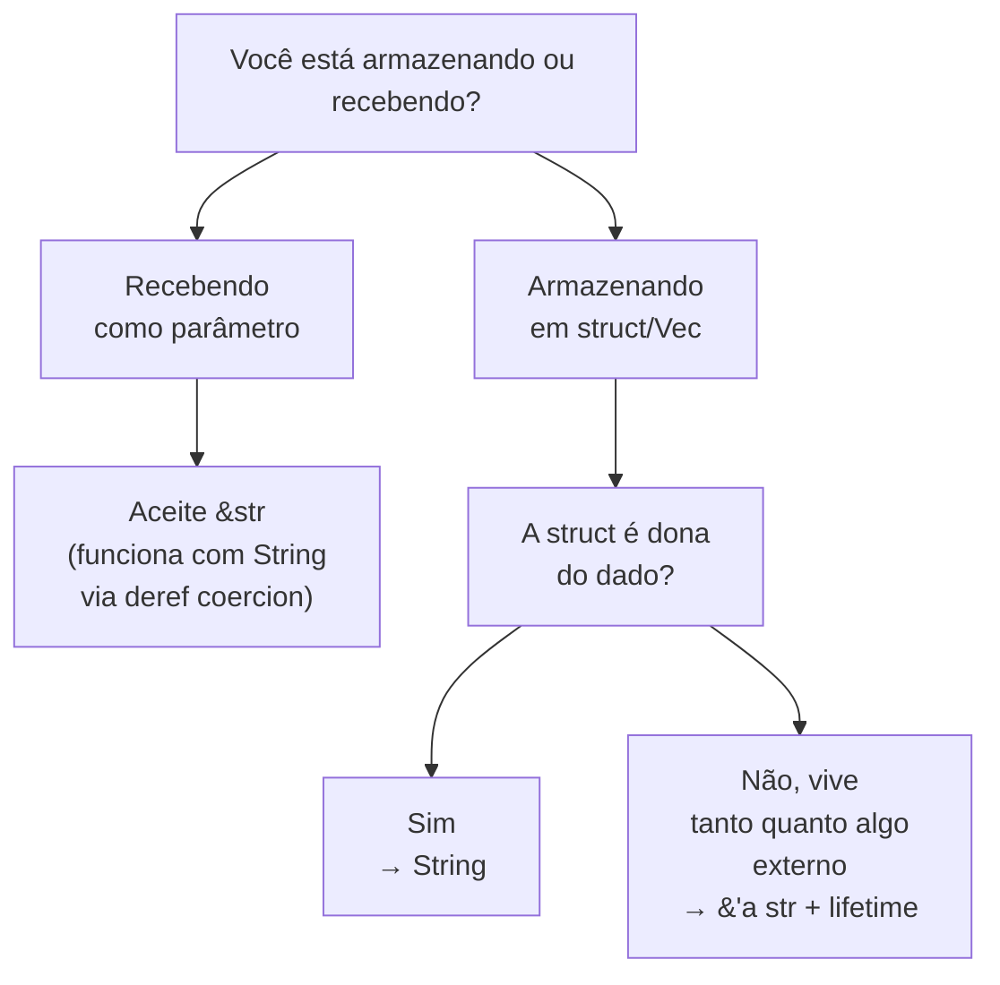
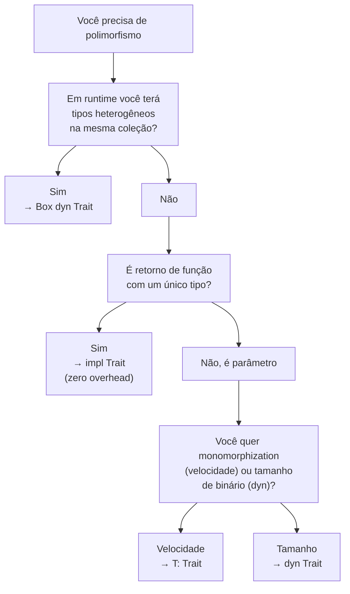
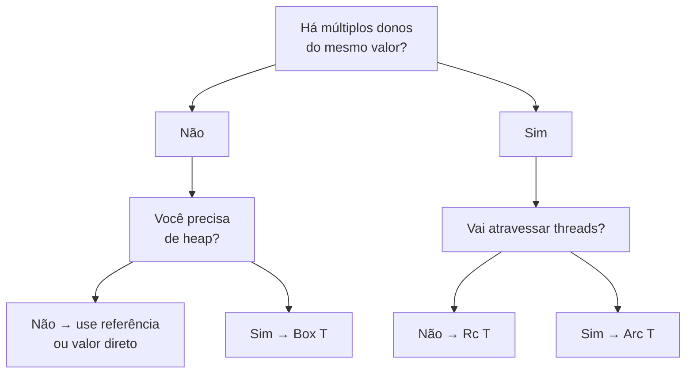
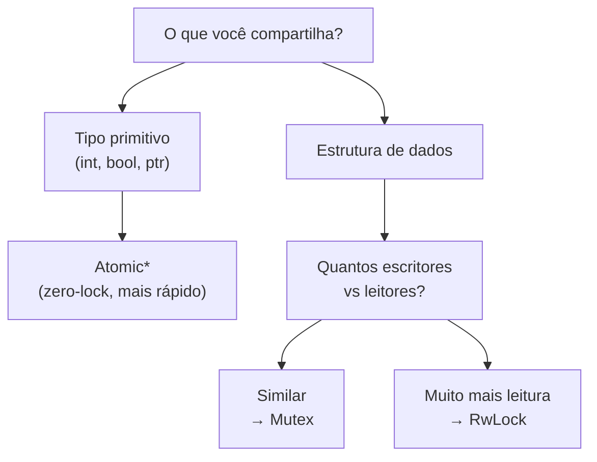
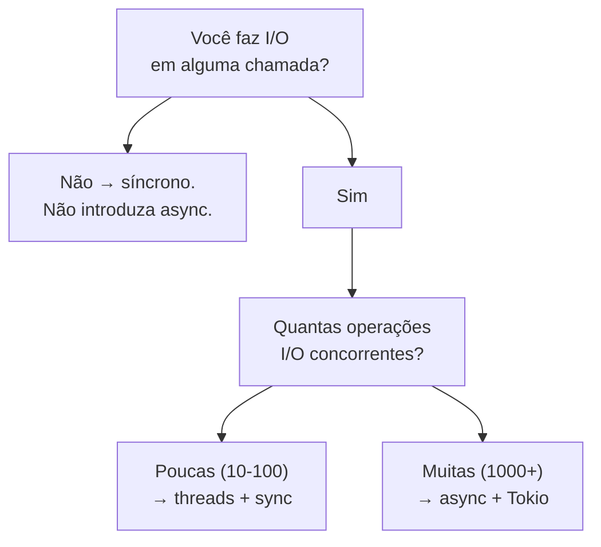
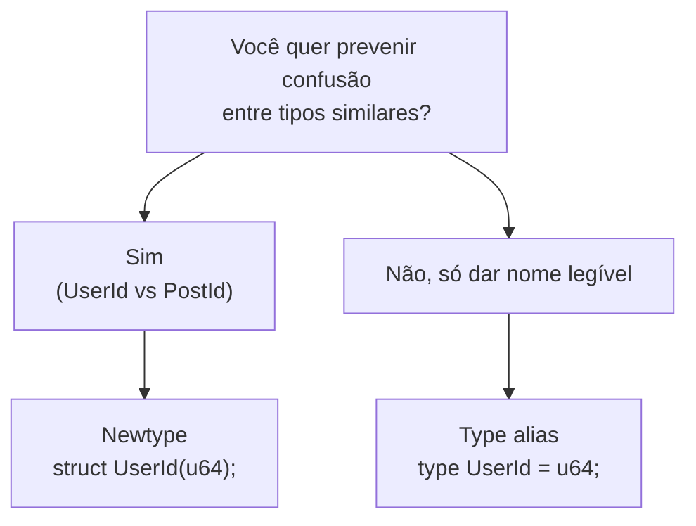
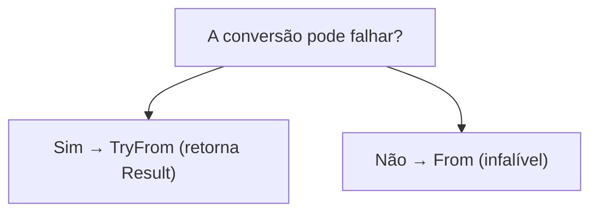

# Árvores de Decisão

> Diagramas e regras para escolhas comuns em Rust. Quando estiver em dúvida, comece aqui.

---

## 1. `String` ou `&str`?

**Regra:** parâmetro = `&str`. Campo que possui = `String`. Campo que referencia = `&'a str` (mas quase sempre prefira `String` em código de aplicação).

---

## 2. `Vec<T>`, `Box<[T]>`, `&[T]`, ou `[T; N]`?

| Use | Quando |
|---|---|
| `[T; N]` | Tamanho fixo conhecido em compile time, vai pra stack |
| `Vec<T>` | Tamanho dinâmico, mutável, dono |
| `Box<[T]>` | Tamanho fixo determinado em runtime, dono, sem capacidade extra |
| `&[T]` | Visão imutável (parâmetro idiomático) |
| `&mut [T]` | Visão mutável sem mexer no tamanho |

Default: passe `&[T]` em parâmetros, retorne `Vec<T>` ou armazene `Vec<T>`. Otimize para `Box<[T]>` quando capacidade é desperdício.

---

## 3. `Box<dyn Trait>`, `impl Trait`, ou `<T: Trait>`?

Regra prática: `<T: Trait>` por default. `impl Trait` em retorno. `Box<dyn Trait>` apenas quando heterogeneidade real em runtime.

---

## 4. `Rc`, `Arc`, `Box`, ou referência?

Regra: prefira referências `&T`. Use `Box` para heap. `Rc` para single-thread shared. `Arc` para multi-thread shared. Acumular `Arc<Mutex<T>>` em todo lugar é red flag — repense ownership.

---

## 5. `Mutex`, `RwLock`, ou `Atomic`?

Default: `Mutex`. `RwLock` quando leitura é 10x+ mais frequente que escrita. `Atomic*` para flags e contadores. `parking_lot::Mutex` se perf importa.

---

## 6. `Result`, `Option`, ou `panic!`?

| Situação | Escolha |
|---|---|
| Operação pode falhar de forma esperada | `Result<T, E>` |
| Valor pode estar ausente sem ser erro | `Option<T>` |
| Programa em estado impossível (invariante quebrada) | `panic!` |
| Index out of bounds em valor controlado por dev | `panic!` (via `[]`) |
| Valor user-provided que pode ser inválido | `Result` |
| Default de campo opcional | `Option` |

Regra moral: `panic!` é para "bug do programador", `Result` é para "erro do mundo".

---

## 7. Síncrono ou async?

Regra: async tem custo cognitivo e de compile time. Use quando você *precisa* de muitas operações concorrentes I/O-bound. Para CPU-bound, threads. Para I/O moderado, threads.

---

## 8. `thiserror` ou `anyhow`?

| Use | Quando |
|---|---|
| `thiserror` | Você está escrevendo uma **library**. Outros vão querer fazer match no erro. |
| `anyhow` | Você está escrevendo uma **application**. Você só quer logar/reportar. |

Combine ambos: lib expõe erro com `thiserror`, app consome via `anyhow::Result` e propaga com `?`.

---

## 9. Newtype ou type alias?

`type` é só açúcar — mesma representação, sem barreira de tipos. `struct UserId(u64)` cria barreira: você não pode passar `PostId` onde `UserId` é esperado. Quase sempre vale o boilerplate.

---

## 10. Mover, emprestar imutável, ou mutável?

| Quero | Assinatura |
|---|---|
| Que a função consuma o valor (transferindo posse) | `fn foo(x: T)` |
| Que a função leia o valor sem modificar nem consumir | `fn foo(x: &T)` |
| Que a função modifique o valor sem consumi-lo | `fn foo(x: &mut T)` |
| Trabalhar com slice em vez de coleção específica | `fn foo(x: &[T])` em vez de `&Vec<T>` |
| Aceitar `String` ou `&str` | `fn foo(x: impl AsRef<str>)` ou `&str` |

Regra: comece sempre com `&T`. Promova para `&mut T` se precisar modificar. Use `T` (move) só quando a função é a sucessora natural do dono (ex: `into_iter`, `into_string`).

---

## 11. `From` ou `TryFrom`?

`From` automaticamente dá `Into`. Implemente `From` sempre que possível — o ecossistema espera isso.

---

## 12. `Iterator` adapter ou `for` loop?

| Use | Quando |
|---|---|
| `iter().map(...).filter(...).collect()` | Transformações funcionais, lazy, encadeadas |
| `for x in v` | Side effects, controle de fluxo complexo, early break com state |

Não há penalidade de performance — iterators são zero-cost. A escolha é estilística e de clareza.

---

[← Voltar ao sumário](../SUMMARY.md) | [Glossário ←](glossario.md) | [Cheat Sheet →](cheat-sheet.md)
